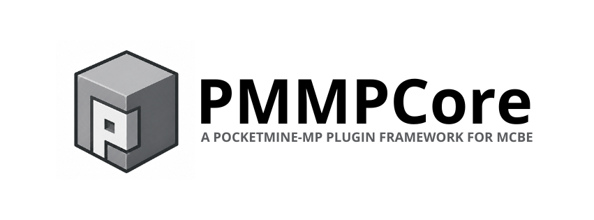

# PMMPCore

Idioma: [English](readme.md) | **Español**

**Framework modular para Minecraft Bedrock Edition**

[Documentación](#documentacion) · [Hoja de ruta](#hoja-de-ruta-integrada) · [Contribuir](#contribuir)

---

## Resumen

PMMPCore es un framework que adapta un enfoque modular estilo PocketMine al ecosistema Bedrock, con arquitectura orientada a plugins, persistencia centralizada y comandos tipados.

Está diseñado para crear servidores/addons complejos de forma mantenible, incluso bajo las limitaciones de la Bedrock Script API.

## Documentación

- Guía general del proyecto (ES): `docs/PROJECT_DOCUMENTATION.es.md`
- Guía de creación de plugins (ES): `docs/PLUGIN_DEVELOPMENT_GUIDE.es.md`
- Documentación de MultiWorld (ES): `docs/MULTIWORLD_DOCUMENTATION.es.md`
- General project guide (EN): `docs/PROJECT_DOCUMENTATION.md`
- Plugin creation guide (EN): `docs/PLUGIN_DEVELOPMENT_GUIDE.md`
- MultiWorld documentation (EN): `docs/MULTIWORLD_DOCUMENTATION.md`
- Índice de documentación EN: `docs/README.md`
- Índice de documentación ES: `docs/README.es.md`

## Estado actual

- Fase actual: **prototipo funcional en evolución**.

### Estado de plugins

| Plugin | Estado |
| --- | --- |
| PurePerms | ✅ Complete |
| PureChat | 📋 Planned |
| MultiWorld | 🔄 Process |
| EconomyAPI | 📋 Planned |
| ScoreHub | 📋 Planned |
| WelcomeMessage | 📋 Planned |
| Portals | 📋 Planned |
| WarpGUI | 📋 Planned |
| MineSystem | 📋 Planned |
| CPlots | 📋 Planned |
| SignShop | 📋 Planned |
| Slapper | 📋 Planned |
| PlaceholderAPI | 📋 Planned |
| essentialsTP | 📋 Planned |

## Hoja de ruta integrada

### Fase 1 - Base estable del framework

- [x] Núcleo PMMPCore funcional.
- [x] Registro y habilitación centralizada de plugins.
- [x] Persistencia base con `DatabaseManager`.
- [x] Comandos base del core.

### Fase 2 - MultiWorld robusto

- [x] CRUD de mundos (`create`, `tp`, `list`, `info`, `delete`).
- [x] Tipos: `normal`, `flat`, `void`, `skyblock`.
- [x] Limpieza por lotes (`purgechunks`).
- [x] Mundo principal configurable (`setmain`, `main`).
- [x] Control de spawn global (`setspawn`) y diagnósticos de spawn (`info`).
- [x] Restauración en reconexión para mundos no-main y modo lobby opcional.

## Contribuir

Si contribuyes al proyecto:

- mantén compatibilidad con la Bedrock Script API usada por el repo;
- evita romper contratos existentes del core/plugins;
- documenta cambios funcionales relevantes en `docs/`;
- prioriza cambios incrementales y verificables.

