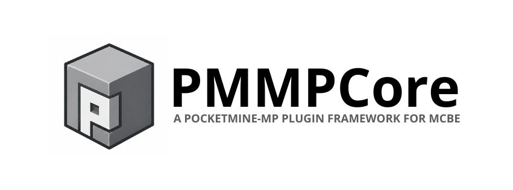

# PMMPCore

Idioma: [English](README.md) | **Español**

<div align="center">



**Framework modular para Minecraft Bedrock Edition (Behavior Packs)**

[](#estado)
[](LICENSE.md)
[](https://www.minecraft.net/en-us/download/bedrock-edition)

[Inicio rápido](#inicio-rápido) · [Documentación](#documentación) · [Ecosistema](#ecosistema-de-addons-independientes) · [Contribuir](#contribuir)

</div>

## Tabla de Contenidos

1. [¿Qué es PMMPCore?](#qué-es-pmmpcore)
2. [Estado](#estado)
3. [Inicio rápido](#inicio-rápido)
4. [Ecosistema de Addons Independientes](#ecosistema-de-addons-independientes)
5. [Documentación](#documentación)
6. [Estructura del repo (alto nivel)](#estructura-del-repo-alto-nivel)
7. [Contribuir](#contribuir)
8. [FAQ](#faq)

---

## ¿Qué es PMMPCore?

PMMPCore es un poderoso framework modular para proyectos con Bedrock Script API, inspirado en el ecosistema de plugins estilo PocketMine. Actúa como el puente central de comunicación y base de datos para una familia entera de Addons.

Incluye:

- **Bus de Comunicación (InterAddonBridge v1)**: Interfaz de red sincrónica para que los Addons externos interactúen con el framework vía `scriptevent`.
- **Motor Dual de Permisos**: Sistema de permisos lógicos en memoria (`PurePermsPermissionService`) fuertemente enlazado con los comandos nativos de Operador (`commandPermissionLevel`).
- **Persistencia Centralizada (KV y SQL)**: Acceso seguro de lectura/escritura unificada para todos los Addons con motores relacionales, búferes y Write-Ahead Logging (`DatabaseManager`).
- **Ciclo de Vida Predecible**: Carga de componentes bajo esquemas controlados.

PMMPCore se distribuye como **Behavior Pack** y funciona estrictamente respetando las limitaciones y estándares de la Sandbox de Bedrock Script API.

---

## Estado

- **Estado del proyecto**: Estable `v1.1.5`.
- **Objetivo**: Proveer un core central ultra-fluido (0ms de latencia en consultas a RAM) para que la suite oficial de Addons y terceros puedan construir mecánicas avanzadas en Bedrock.

---

## Inicio rápido

### Requisitos

- Minecraft Bedrock 1.21.40+ con **Beta APIs** habilitadas si deseas usar Addons como PureChat.

### Instalar / habilitar

1. Descarga el archivo `PMMPCore-Framework.mcpack`.
2. Importa el archivo a Minecraft Bedrock.
3. Activa el Behavior Pack en tu mundo.
4. Entra al mundo y ejecuta `/diag` para validar la integridad del núcleo.

### Verificación

- `/diag`: Verifica los servicios, bus de eventos, tareas del scheduler y métricas de memoria.
- `/selftest`: Prueba la lectura/escritura de la capa KV relacional y el protocolo IPC.

---

## Ecosistema de Addons Independientes

En versiones anteriores, los plugins venían incrustados dentro del repositorio del framework. A partir de **v1.1.5**, **TODOS los plugins son autónomos** y se distribuyen en sus propios repositorios / archivos `.mcpack`.

Para tener la experiencia completa, debes descargar los Addons que necesites y activarlos junto al PMMPCore:

- **MultiWorld**: Mundos y dimensiones dinámicas personalizadas.
- **PurePerms**: El motor maestro de rangos y permisos, emite jerarquías en RAM.
- **PureChat**: Chat en tiempo real, nametags y prefijos (requiere Beta APIs).
- **ScoreHud**: Scoreboard fluido a 100ms (2 ticks), integrando TPS, % CPU, dinero y rangos.
- **EconomyAPI**: Motor de transacciones y divisas virtuales.
- **PlaceholderAPI**: Extensibilidad de placeholders `%...%` para todos los Addons.
- **EssentialsTP**: Sistema TPA, homes y warps.
- **FormAPI**: Construcción de GUIs complejas en Bedrock.

*(Nota: Cada uno de estos Addons contiene su propio manual técnico `docs/` y su propia licencia dentro de su paquete).*

---

## Documentación

Empieza por:

- **Índice de docs**: `docs/README.es.md`

Referencias del core:

- **API pública (servicios y puente IPC)**: `docs/API_PUBLIC_GUIDE.es.md`
- **Base de datos (KV, RelationalEngine + SQL)**: `docs/DATABASE_GUIDE.es.md`
- **Guía de Desarrollo de Addons V1 (Standalone)**: `docs/INTER_ADDON_DEVELOPMENT_GUIDE.es.md`

---

## Estructura del repo (alto nivel)

```text
scripts/
  main.js                  # Pipeline de inicialización segura
  PMMPCore.js              # Core y service registry
  client/                  # Módulos cliente SDK
  core/                    # Puente IPC (InterAddonBridge), eventos, permisos
  db/                      # RelationalEngine, Codecs, Storage
docs/
  README.es.md             # Índice central
  INTER_ADDON...es.md      # Protocolo de creación de addons
  ...
```

---

## Contribuir

- Prioriza siempre cambios **retrocompatibles** en la API pública.
- Utiliza el sistema de eventos `bus_event` del puente IPC para conectar módulos desacoplados.

---

## FAQ

**P: ¿Dónde están las carpetas `scripts/plugins/`?**  
R: Se han eliminado. Desde la versión v1.1.5 la arquitectura es 100% modular. Debes descargar los plugins oficiales por separado y activarlos como packs adicionales en tu mundo.

**P: ¿Por qué PureChat no muestra los prefijos en mi servidor?**  
R: Bedrock implementa la captura de chat nativo bajo los experimentos de script. Debes activar **Beta APIs** en la configuración de tu mundo y asegurarte de tener PurePerms cargado.

**P: ¿Qué ocurre si elimino el Behavior Pack del PMMPCore?**  
R: El resto de los Addons independientes detectarán la caída del motor IPC y se deshabilitarán con seguridad, pero los datos guardados en el mundo (KV) no se perderán.
