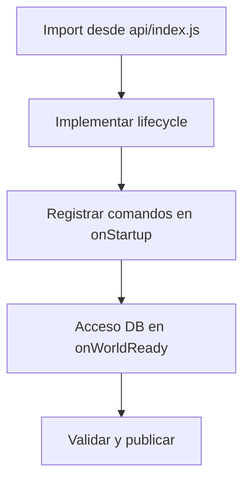
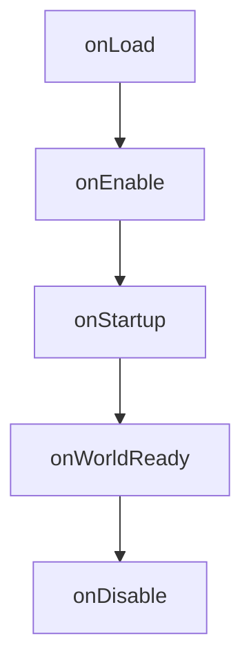
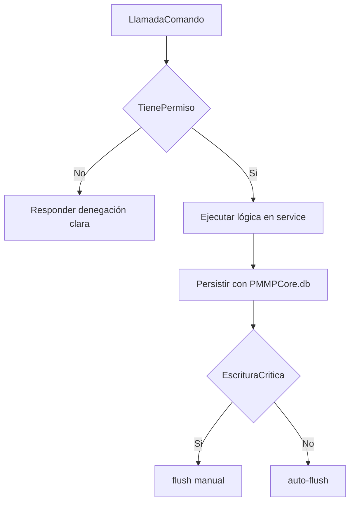
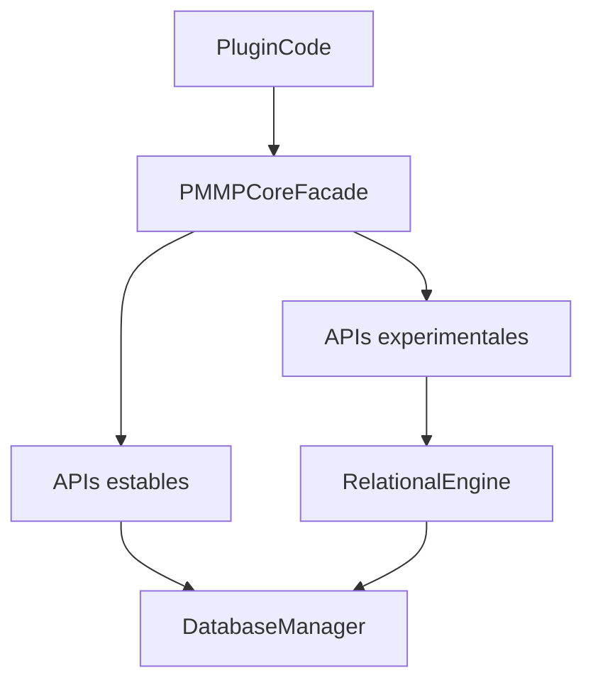

# Guía de API pública de PMMPCore

Idioma: **Español** | [English](API_PUBLIC_GUIDE.md)

Esta guía es la referencia canónica de la API pública de PMMPCore. Está pensada para autores de plugins que quieren construir funcionalidades sin depender de internals inestables.

## Table of Contents

1. [Inicio rápido para autores nuevos](#inicio-r%C3%A1pido-para-autores-nuevos)
2. [Qué significa "API pública" en PMMPCore](#1-qui%C3%A9n-significa-api-p%C3%BAblica-en-pmmcore)
3. [Política de estabilidad](#2-pol%C3%ADtica-de-estabilidad)
   - [`stable`](#stable)
   - [`experimental`](#experimental)
   - [`internal`](#internal)
4. [Importar APIs PMMPCore correctamente](#3-importar-apis-pmmcore-correctamente)
5. [Contrato de lifecycle (crítico para fiabilidad)](#4-contrato-de-lifecycle-cr%C3%ADtico-para-fiabilidad)
   - [Por qué importa `onWorldReady()`](#por-qu%C3%A9-importa-onworldready)
   - [Matriz de lifecycle: qué hacer y qué no](#matriz-de-lifecycle-qui%C3%A9n-hacer-y-qui%C3%A9n-no)
6. [Puntos de entrada principales que usarás](#5-puntos-de-entrada-principales-que-usar%C3%A1s)
7. [Patrones de uso prácticos](#6-patrones-de-uso-pr%C3%A1cticos)
   - [Plugin mínimo (lifecycle seguro)](#plugin-m%C3%ADnimo-lifecycle-seguro)
   - [Migraciones + hidratación](#migraciones--hidrataci%C3%B3n)
   - [Checks de permisos vía contrato estable](#checks-de-permisos-v%C3%ADa-contrato-estable)
   - [Flujos de falla comunes](#flujos-de-falla-comunes)
8. [Referencia de exports públicos (`scripts/api/index.js`)](#7-referencia-de-exports-p%C3%BAblicos-scriptsapiindexjs)
9. [Anti-patrones a evitar](#8-anti-patrones-a-evitar)
10. [Matriz de decisión rápida](#9-matriz-de-decisi%C3%B3n-r%C3%A1pida)
    - [Referencia de flujo de datos](#referencia-de-flujo-de-datos)
11. [Referencias cruzadas](#10-referencias-cruzadas)
12. [FAQ](#11-faq)
13. [Troubleshooting](#troubleshooting)
14. [Ver también](#ver-tambi%C3%A9n)

---

## Inicio rápido para autores nuevos

Si es tu primer plugin en PMMPCore:

1. Importa únicamente desde `scripts/api/index.js`.
2. Registra comandos en `onStartup(event)`.
3. Usa DB en `onWorldReady()`.
4. Protege comandos con permisos.
5. Mueve lógica de negocio a `service.js`.



---

## 1) Qué significa “API pública” en PMMPCore

En este repositorio, un símbolo se considera público si:

1. Está exportado por `scripts/api/index.js`, y
2. Está documentado en esta guía (o en docs core asociadas).

Si existe código en `scripts/` pero no está exportado/documentado como público, se considera detalle interno.

Por qué importa:

- Evitas romperte en refactors.
- Puedes razonar sobre estabilidad (`stable`, `experimental`, `internal`).
- Los devs nuevos saben qué superficie es segura de usar.

---

## 2) Política de estabilidad

### `stable`

- Pensado para uso general por plugins del ecosistema.
- Cambios breaking requieren decisión de versión mayor.
- Ejemplos: `PMMPCore.db`, `PMMPCore.getDataProvider()`, `PMMPCore.getPermissionService()`.

### `experimental`

- Público, pero puede evolucionar en firmas/comportamiento.
- Úsalo cuando necesitas la feature y aceptas mantener el plugin actualizado.
- Ejemplos: `RelationalEngine`, `CommandBus`, `Scheduler`, `MigrationService`.

### `internal`

- No apto para dependencias externas.
- Puede cambiar en cualquier momento.

---

## 3) Cómo importar la API correctamente

PMMPCore es un proyecto de Behavior Pack, no un paquete npm. “Instalar” plugins normalmente significa tenerlos dentro de `scripts/plugins/` e importar por rutas relativas.

Recomendado:

```javascript
import { PMMPCore, PMMPDataProvider, RelationalEngine } from "../api/index.js";
```

Evita imports profundos (`../core/...`) salvo necesidad documentada.

---

## 4) Contrato de lifecycle (crítico para estabilidad)

El plugin debería seguir este contrato:

- `onLoad()` -> setup liviano (constantes, flags, wiring)
- `onEnable()` -> suscripciones, estado local, registro de migraciones
- `onStartup(event)` -> registro de comandos/enums de Bedrock
- `onWorldReady()` -> primer I/O seguro del mundo, hidratar data, correr migraciones
- `onDisable()` -> limpieza y flush final opcional

### Por qué `onWorldReady()` es clave

`PMMPCore.db` usa Dynamic Properties. En ejecución temprana, Bedrock puede lanzar:

`Native function [World::getDynamicProperty] cannot be used in early execution`

Por eso el primer acceso a DB debe ir en `onWorldReady()` (o un flujo equivalente seguro post-world-load).

---

## 4.1 Matriz de qué hacer y qué no hacer

| Fase | Operaciones seguras | Operaciones no seguras |
|---|---|---|
| `onLoad` | constantes, flags, wiring | DB read/write |
| `onEnable` | suscripciones, registro de migraciones | hidratación pesada de mundo |
| `onStartup` | enums y firma de comandos | `PMMPCore.db.get/set` |
| `onWorldReady` | DB, migraciones, cachés | loops bloqueantes sin chunking |
| `onDisable` | cleanup, flush final | escrituras riesgosas sin control |



---

## 5) Entry points principales que usarás

### `PMMPCore.db` (stable)

Para persistencia key-value:

- `get`, `set`, `delete`, `has`
- helpers de plugin/jugador (`getPluginData`, `setPluginData`, etc.)
- `flush()` para durabilidad explícita tras operaciones críticas

Úsalo cuando:

- Necesitas estado persistente simple
- Quieres máxima compatibilidad con menor complejidad

### `PMMPCore.getDataProvider()` (stable)

Fachada estilo PMMP sobre el mismo storage:

- `loadPlayer`, `savePlayer`, `loadPluginData`, `savePluginData`, `flush`, etc.

Úsalo cuando:

- Prefieres API tipo DataProvider
- Estás portando lógica inspirada en PMMP

### `PMMPCore.getPermissionService()` (stable)

Contrato estable de permisos (usualmente respaldado por PurePerms):

- `has(...)`, `resolve(...)`, helpers de grupos/usuarios

Úsalo en lugar de internals directos de PurePerms cuando sea posible.

### `PMMPCore.createRelationalEngine()` (experimental)

Capa SQL-lite sobre el mismo backend:

- tablas, índices, upsert/find, subset SQL

Úsalo cuando:

- Tus datos tienen patrón relacional
- Necesitas consultas más expresivas que KV plano

### `PMMPCore.getEventBus()` (experimental)

Canal desacoplado para comunicación entre módulos/plugins.

### `PMMPCore.getCommandBus()` (experimental)

Abstracción centralizada para comandos; útil en plugins con muchas rutas y validaciones compartidas.

### `PMMPCore.getScheduler()` (experimental)

Tareas delayed/repeating con presupuesto por tick y mejor observabilidad.

### `PMMPCore.getMigrationService()` (experimental)

Migraciones versionadas por plugin.

---

## 6) Patrones prácticos de uso

## 6.1 Plugin mínimo (lifecycle seguro)

```javascript
import { PMMPCore } from "../../api/index.js";

PMMPCore.registerPlugin({
  name: "MyPlugin",
  version: "1.0.0",
  depend: ["PMMPCore"],

  onEnable() {
    this.context = PMMPCore.getPluginContext("MyPlugin", "1.0.0");
  },

  onStartup(event) {
    // enums + comandos solamente
  },

  onWorldReady() {
    const count = PMMPCore.db.getPluginData("MyPlugin", "bootCount") ?? 0;
    PMMPCore.db.setPluginData("MyPlugin", "bootCount", count + 1);
    PMMPCore.db.flush();
  },
});
```

## 6.2 Migraciones + hidratación

```javascript
onEnable() {
  PMMPCore.getMigrationService()?.register("MyPlugin", 1, () => {
    PMMPCore.db.setPluginData("MyPlugin", "schema", { version: 1 });
  });
}

onWorldReady() {
  PMMPCore.getMigrationService()?.run("MyPlugin");
}
```

## 6.3 Chequeo de permisos con contrato estable

```javascript
const perms = PMMPCore.getPermissionService();
if (!perms?.has(player.name, "pperms.command.myplugin.admin", player.dimension?.id ?? null, player)) {
  player.sendMessage("[MyPlugin] No tienes permisos.");
  return;
}
```

---

## 6.4 Flujo de fallo común



---

## 7) Referencia de exports públicos (`scripts/api/index.js`)

### Core facade

- `PMMPCore`
- `Color`

### Persistencia

- `DatabaseManager` (stable)
- `PMMPDataProvider` (stable)
- `RelationalEngine` (experimental)
- `JsonCodec` (utilidad estable)
- `WalLog` (utilidad experimental)
- `MigrationService` (experimental)

### Servicios (mayoría experimental)

- `ServiceRegistry`
- `EventBus`, `CoreEvent`, `EventPriority`
- `CommandBus`
- `TaskScheduler`
- `TickCoordinator`
- `ObservabilityService`, `CoreLogger`
- `PurePermsPermissionService` (adapter)

Nota: aunque exista un export, prioriza `PMMPCore.get...()` salvo que estés extendiendo framework internamente.

---

## 8) Anti-patrones que debes evitar

- Leer/escribir DB en `onStartup`.
- Usar `world.getDynamicProperty` directo para claves gestionadas por PMMPCore.
- Importar internals profundos sin contrato público.
- Mezclar registro de comandos + persistencia + lógica de negocio en callbacks gigantes.
- Omitir `flush()` después de escrituras críticas que deben sobrevivir cierres abruptos.

---

## 9) Matriz de decisión rápida

- Estado simple persistente -> `PMMPCore.db`
- API estilo PMMP -> `getDataProvider()`
- Consultas estructuradas -> `createRelationalEngine()`
- Permisos -> `getPermissionService()`
- Eventos entre plugins -> `getEventBus()`
- Tareas diferidas/repetitivas -> `getScheduler()`
- Upgrades de datos versionados -> `getMigrationService()`

---

## 9.1 Diagrama de flujo de datos



---

## 12) Troubleshooting

### Síntoma: "cannot be used in early execution"

**Causa**: Intentar usar `PMMPCore.db` o Dynamic Properties en `onStartup` o fases tempranas.

**Solución**: Mover todas las operaciones de DB a `onWorldReady()`. Mantener `onStartup` solo para registro de comandos/enums.

### Síntoma: El plugin carga pero los comandos no funcionan

**Causa**: Comandos registrados en fase incorrecta de lifecycle o falta registro de enums.

**Solución**: Registrar comandos en `onStartup(event)` y asegurar sintaxis correcta de registro.

### Síntoma: Los checks de permisos siempre fallan

**Causa**: Usar servicio de permisos incorrecto o formato de nodo incorrecto.

**Solución**: Usar `PMMPCore.getPermissionService()` y verificar que los nombres de nodo coincidan con configuración de PurePerms.

### Síntoma: Los datos no persisten después de reiniciar

**Causa**: Falta llamada a `flush()` después de escrituras críticas.

**Solución**: Llamar a `PMMPCore.db.flush()` después de mutaciones importantes o usar servicio de migraciones.

---

## 10) Lecturas relacionadas

- Persistencia y durabilidad: `docs/DATABASE_GUIDE.es.md`
- Arquitectura y runtime: `docs/PROJECT_DOCUMENTATION.es.md`
- Crear plugins end-to-end: `docs/PLUGIN_DEVELOPMENT_GUIDE.es.md`
- Migrar plugins legacy: `docs/PLUGIN_MIGRATION_GUIDE.es.md`

---

## 11) FAQ

### ¿Tengo que importar desde `scripts/api/index.js`?

Sí. Para código de plugins es la ruta más segura porque representa la superficie pública curada.

### ¿Puedo usar APIs experimentales en producción?

Sí, pero conviene encapsularlas detrás de wrappers propios para facilitar ajustes futuros.

### ¿`PMMPCore.db` alcanza para la mayoría de plugins?

Casi siempre sí. Empieza con KV y usa `RelationalEngine` solo cuando la complejidad de consultas lo justifique.

### ¿Dónde registro comandos y dónde cargo datos?

Comandos en `onStartup(event)`. Carga/persistencia de datos en `onWorldReady()`.

### ¿Debo acceder a PurePerms directamente?

Primero usa `PMMPCore.getPermissionService()`. Recurre a internals de backend solo si es estrictamente necesario.

### ¿Qué mínimo documental debe tener un plugin?

Como mínimo:

- quickstart de onboarding,
- comandos + permisos,
- errores frecuentes y troubleshooting,
- al menos un diagrama de arquitectura/runtime.

---

## 13) Ver también

- [Guía de base de datos](DATABASE_GUIDE.es.md) - Documentación completa de capa de persistencia
- [Documentación del proyecto](PROJECT_DOCUMENTATION.es.md) - Arquitectura y flujo de runtime
- [Guía de desarrollo de plugins](PLUGIN_DEVELOPMENT_GUIDE.es.md) - Creación de plugins end-to-end
- [Guía de migración de plugins](PLUGIN_MIGRATION_GUIDE.es.md) - Patrones de migración legacy a v1
- [Playbook de troubleshooting](TROUBLESHOOTING_PLAYBOOK.es.md) - Debugging basado en síntomas
