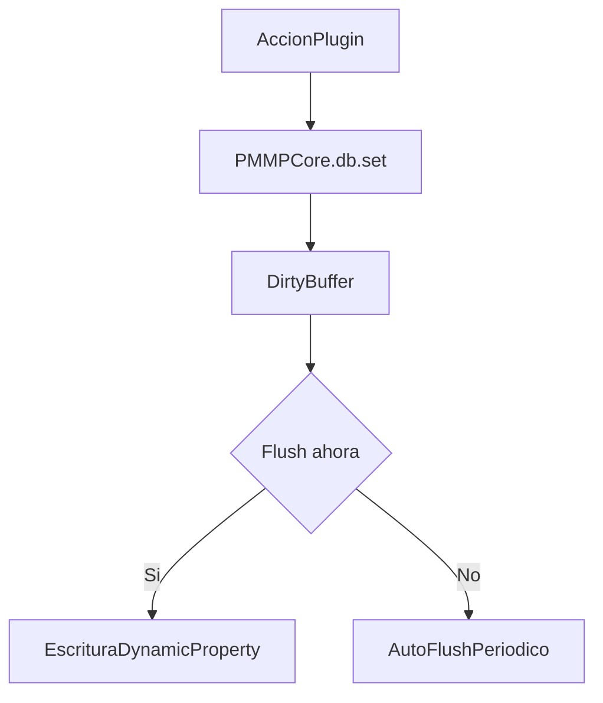
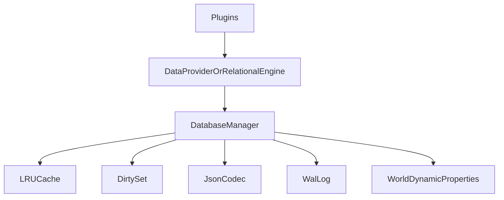
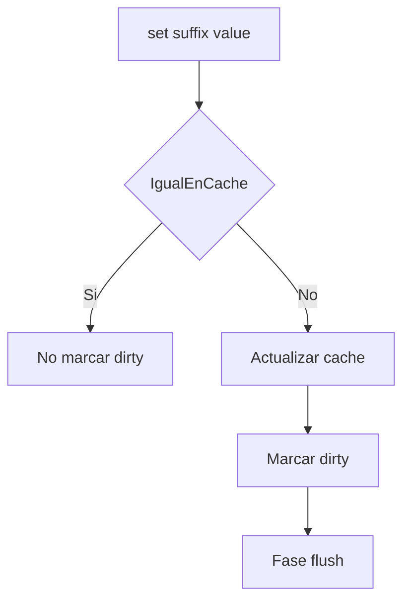
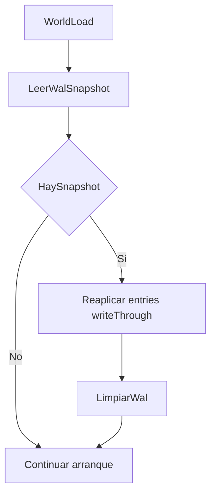
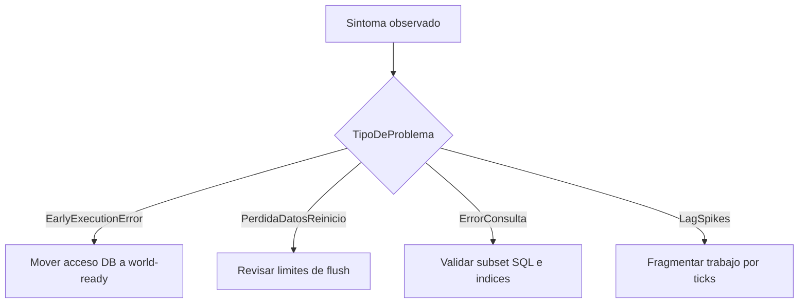

# Capa de base de datos PMMPCore — Guía para desarrolladores

Idioma: [English](DATABASE_GUIDE.md) | **Español**

Este documento es la referencia principal de la persistencia en PMMPCore: el almacén clave-valor (`DatabaseManager`), la fachada opcional estilo PocketMine (`PMMPDataProvider`) y la capa relacional (`RelationalEngine`). Está dirigida a autores de plugins en behavior packs y a quienes extienden el framework.

---

## Inicio rápido (entry-level)

Si solo quieres persistir estado de plugin de forma segura:

1. Usa `PMMPCore.db`.
2. No uses DB en early execution.
3. Primera E/S en `onWorldReady()`.
4. Llama `flush()` tras escrituras críticas.



---

## Índice

1. [Qué es (y qué no es)](#1-qué-es-y-qué-no-es)
2. [Arquitectura](#2-arquitectura)
3. [Restricciones de la plataforma](#3-restricciones-de-la-plataforma)
4. [Cuándo puedes usar la base de datos](#4-cuándo-puedes-usar-la-base-de-datos)
5. [DatabaseManager (núcleo KV)](#5-databasemanager-núcleo-kv)
6. [Caché, clonado y flush](#6-caché-clonado-y-flush)
7. [Registro write-ahead (WAL)](#7-registro-write-ahead-wal)
8. [PMMPDataProvider](#8-pmmpdataprovider)
9. [RelationalEngine](#9-relationalengine)
10. [Dialecto SQL (subconjunto soportado)](#10-dialecto-sql-subconjunto-soportado)
11. [Espacios de nombres de claves](#11-espacios-de-nombres-de-claves)
12. [Diagnóstico](#12-diagnóstico)
13. [Buenas prácticas](#13-buenas-prácticas)
14. [Resolución de problemas](#14-resolución-de-problemas)
15. [Imports de módulos](#15-imports-de-módulos)

---

## 1. Qué es (y qué no es)

**Es:**

- Un **almacén clave-valor con un único escritor** respaldado en las **Dynamic Properties** del mundo de Minecraft Bedrock, con **caché LRU** en memoria, **buffer dirty**, **`flush()`** periódico y manual, y un **snapshot WAL** opcional durante el flush para recuperación con límites razonables.
- Una **capa relacional opcional** con tablas, índices, un **subconjunto tipo SQL** para `SELECT` y APIs programáticas (`upsert`, `find`, etc.). Toda la persistencia relacional sigue pasando por `DatabaseManager`.

**No es:**

- SQLite, PostgreSQL ni un motor SQL real. No hay protocolo SQL, archivo `.db`, replicación en vivo entre mundos ni garantías ACID completas sobre varias propiedades.
- Sustituto de bases externas. Todo está acotado por la API de Dynamic Properties y el alcance del mundo.

---

## 2. Arquitectura

```text
Plugins / RelationalEngine / PMMPDataProvider
                    │
                    ▼
            DatabaseManager
         (caché, dirty, codec, flush, WAL)
                    │
                    ▼
      world.getDynamicProperty / setDynamicProperty
```



**Regla:** El código de aplicación y plugins **no** debe llamar a `getDynamicProperty` / `setDynamicProperty` del mundo para datos de PMMPCore. Usa `PMMPCore.db` (o inyecta `DatabaseManager`). El WAL interno puede tocar el mundo solo en claves `pmmpcore:wal:*` como parte de esta implementación.

---

## 3. Restricciones de la plataforma

| Restricción | Implicación |
|-------------|-------------|
| Tipo de almacenamiento | Los valores se guardan como **cadenas** (JSON vía `JsonCodec`). |
| Tamaño por propiedad | Trata **~32 767 caracteres** como techo práctico por Dynamic Property. Parte cargas grandes en varias claves (MultiWorld y `RelationalEngine` ya fragmentan filas grandes). |
| API síncrona | `setDynamicProperty` es síncrono. Bucles que escriben muchas claves en un tick pueden causar tirones; reparte trabajo entre ticks. |
| Alcance del mundo | Solo se accede al mundo **actual**. La “replicación” a otro mundo es **exportar/importar** snapshots de claves, no sincronización en vivo. |
| Early execution | Durante `beforeEvents.startup` / `onStartup`, las APIs de Dynamic Properties **no están disponibles** para uso normal. Ver [sección 4](#4-cuándo-puedes-usar-la-base-de-datos). |

---

## 4. Cuándo puedes usar la base de datos

**No** leas ni escribas `PMMPCore.db` desde:

- manejadores de `system.beforeEvents.startup` (salvo registrar comandos u otra lógica sin E/S al mundo), ni
- `onStartup` del plugin si corre en la misma fase temprana donde el motor muestra *"cannot be used in early execution"*.

**Sí** aplaza el primer acceso a:

- `world.afterEvents.worldLoad`, o
- `system.run` / `system.runTimeout` **después** de que el mundo esté listo,

siguiendo el mismo patrón que los plugins del core (p. ej. EconomyAPI tras `world load`).

Los callbacks de comandos y eventos de juego suelen ejecutarse fuera de early execution y pueden usar `PMMPCore.db` con normalidad.

---

## 5. DatabaseManager (núcleo KV)

La instancia compartida es **`PMMPCore.db`** tras `PMMPCore.initialize(...)` en `main.js`.

### Opciones del constructor

```javascript
new DatabaseManager({
  cacheLimit: 500,  // opcional, por defecto 500 entradas LRU (fullKey)
  wal: true,        // opcional, por defecto true — snapshot WAL al inicio del flush
});
```

### API genérica clave-valor

Las claves son **sufijos** sin el prefijo `pmmpcore:`; el gestor antepone `pmmpcore:`.

| Método | Descripción |
|--------|-------------|
| `get(suffix)` | Devuelve el valor parseado o `null`. Objetos y arrays van **clonados** con `structuredClone`. |
| `set(suffix, value)` | Actualiza caché y marca dirty. Persiste en el siguiente `flush()` (o auto-flush). |
| `delete(suffix)` | Quita de caché y dirty; **borra al instante** la Dynamic Property. |
| `has(suffix)` | Verdadero si existe en caché o en el mundo. |
| `flush()` | Escribe todas las claves dirty al mundo; si todo va bien, limpia el WAL. Devuelve `boolean`. |
| `replayWalIfAny()` | Reaplica un snapshot WAL pendiente (el core lo llama en `worldLoad`). |
| `listPropertySuffixes(prefix)` | Lista sufijos bajo `pmmpcore:` que empiezan por `prefix` (uso interno de `RelationalEngine`). |

### Helpers de jugador y plugin

| Método | Notas |
|--------|--------|
| `getPlayerData(name)` | Devuelve `{}` si no hay datos. |
| `setPlayerData(name, data)` | Sustituye el documento del jugador. |
| `getPluginData(pluginName, key?)` | Sin `key`, objeto completo; con `key`, ese campo. |
| `setPluginData(pluginName, key, value)` | Un campo, u objeto en `key` para mezcla superficial. |

### Helpers MultiWorld (shards)

| Método | Sufijo |
|--------|--------|
| `getWorldIndex()` / `setWorldIndex(names)` | `mw:index` |
| `getWorld(name)` / `setWorld(name, data)` | `mw:world:<name>` |
| `getChunks(name)` / `setChunks(name, keys)` | `mw:chunks:<name>` |
| `deleteWorld(name)` | Borra mundo + chunks. |

`flushWorldData()` de MultiWorld termina con **`PMMPCore.db.flush()`** para no dejar el estado solo en RAM.

### Estadísticas

`getStats()` devuelve `totalKeys`, `estimatedSize`, `keys`, `dirtyKeys`. Sirve para `/info` y vigilancia de capacidad.

---

## 6. Caché, clonado y flush

- **`get`** devuelve un **clon** de objetos y arrays. Si mutas el resultado, **no** se persiste. Llama siempre a **`set`** (o a un helper) tras cambios.
- **`set`** puede omitir marcar dirty si `JSON.stringify` coincide con el valor en caché.
- **Auto-flush:** `main.js` usa `system.runInterval` (por defecto **120 ticks**) que llama a `PMMPCore.db.flush()`.
- **Flush manual:** `PMMPCore.db.flush()` tras lotes críticos o cuando necesites durabilidad inmediata.

---

## 6.1 Detalle del camino de escritura



---

## 7. Registro write-ahead (WAL)

**Objetivo:** Recuperación razonable si el juego se cierra entre escribir el snapshot WAL y terminar todas las escrituras de un `flush()`.

**Comportamiento:**

1. Si hay dirty y el WAL está activo, `flush()` escribe un JSON `{ suffix, value }[]` en `pmmpcore:wal:0` (o `:1` si el payload es grande/truncado).
2. Luego escribe cada clave dirty en su Dynamic Property.
3. Si todo tiene éxito, borra las claves WAL.

En **`world.afterEvents.worldLoad`**, el core llama **`replayWalIfAny()`**: si hay snapshot, aplica entradas con **`_writeThrough`** y limpia WAL.

**Pruebas:** Abortar `flush()` justo después del snapshot (solo desarrollo) es la forma fiable de probar replay; matar el cliente a ciegas no lo es.

**Límites:** No es un log transaccional completo; no hay garantía fuerte ante fallos a mitad de flush sin snapshot válido.

---

## 7.1 Flujo de replay WAL



---

## 8. PMMPDataProvider

Fachada fina estilo PocketMine sobre `DatabaseManager`.

```javascript
const dp = PMMPCore.getDataProvider();
if (!dp) return;
dp.loadPlayer(name);
dp.savePlayer(name, data);
dp.existsPlayer(name);
dp.deletePlayer(name);
dp.loadPluginData("MyPlugin");
dp.savePluginData("MyPlugin", data);
dp.get(key); dp.set(key, v); dp.exists(key); dp.delete(key);
dp.flush();
```

---

## 9. RelationalEngine

```javascript
const rel = PMMPCore.createRelationalEngine();
```

Requiere PMMPCore inicializado. Solo usa `DatabaseManager`. Prefijo de almacenamiento: **`rtable:`** (bajo `pmmpcore:`).

### Ejemplo mínimo (seguro tras worldLoad)

```javascript
import { world } from "@minecraft/server";
import { PMMPCore } from "./PMMPCore.js";

world.afterEvents.worldLoad.subscribe(() => {
  const rel = PMMPCore.createRelationalEngine();
  rel.createTable("items", {});
  rel.createIndex("items", "kind");
  rel.upsert("items", "pickaxe_1", { kind: "tool", tier: 2 });
  PMMPCore.db.flush();
});
```

No pongas esta lógica en `onStartup` (early execution). Suscríbete una vez o usa un flag de módulo si solo debe ejecutarse una vez por sesión.

### Tablas

```javascript
rel.createTable("players", { money: "number", rank: "string" });
```

### Filas

| Método | Descripción |
|--------|-------------|
| `upsert(table, id, data)` | `{ id, ...data }`; actualiza índices; fragmenta JSON si supera ~28k caracteres. |
| `getRow(table, id)` | Fila o `null`. |
| `deleteRow(table, id)` | Borra shards, meta e índices. |

### Índices

- Simple: `createIndex(table, field)` — necesario para `find(table, { field: value })`.
- Compuesto: `createCompositeIndex(table, ["f1","f2"])` con `findComposite(table, ["f1","f2"], [v1,v2])`.

### Consultas programáticas

`findAll`, `find`, `findComposite` (ver guía en inglés para detalle).

### Migraciones y análisis

```javascript
rel.migrate(1, (engine) => { engine.createTable("ledger", {}); });
rel.analyze("players"); // >1000 filas usa muestreo
```

### SQL

- `executeQuery(sql)` — síncrono.
- `executeQueryAsync(sql, system, onDone, chunkSize?)` — trocea filtros con `system.run`.

### Vistas materializadas

`createMaterializedView`, `getMaterializedView`, `refreshMaterializedView`.

### Caché de consultas

Cualquier `upsert` o `deleteRow` hace **`queryCache.clear()`** (invalidación global).

---

## 10. Dialecto SQL (subconjunto soportado)

El parser es deliberadamente pequeño. Lo no listado aquí debe considerarse **no soportado** salvo que verifiques el código en `scripts/db/RelationalEngine.js`.

**Soportado (típico):**

- `SELECT *` o `SELECT col1, col2, COUNT(*), SUM(col)`
- `FROM tabla`
- `WHERE` con `AND` / `OR`, operadores `=`, `!=`, `>`, `<`, `>=`, `<=`
- Literales entre comillas simples o dobles
- `INNER JOIN tabla ON izq = der` (también `JOIN`); claves tipo `tabla.columna`
- `GROUP BY campo` con `COUNT(*)`, `SUM(campo)` en el SELECT
- `ORDER BY campo ASC|DESC`
- `LIMIT n`, `OFFSET n`

**No soportado:** Subconsultas, `HAVING`, `UNION`, DDL como SQL, transacciones, la mayoría de funciones.

---

## 11. Espacios de nombres de claves

| Prefijo (inicio del sufijo) | Uso |
|----------------------------|-----|
| `player:` | Documentos por jugador |
| `plugin:` | Blob por plugin |
| `mw:` | MultiWorld |
| `rtable:` | Motor relacional |
| `wal:` | WAL interno |

---

## 12. Diagnóstico

- En juego: **`/info`**
- Log: prefijo **`[DB]`**

---

## 13. Buenas prácticas

1. Diferir E/S hasta `worldLoad` o más tarde.
2. `flush()` tras escrituras masivas críticas.
3. Mantener documentos pequeños por propiedad; fragmentar grandes.
4. Crear índices antes de `find` / SQL que los asuman.
5. `executeQueryAsync` en tablas grandes.
6. Versionar migraciones con `migrate` o claves `plugin:meta`.

---

## 14. Resolución de problemas

| Síntoma | Revisar |
|---------|---------|
| Error *early execution* | Mover código a `worldLoad` o `system.run`. |
| Datos que vuelven atrás | ¿Se ejecutó `flush`? ¿Cierre antes del auto-flush? |
| `find` sin índice | `createIndex` previo. |
| Error de parse SQL | Comparar con [sección 10](#10-dialecto-sql-subconjunto-soportado). |
| Dirty alto | Normal bajo muchas escrituras hasta el siguiente flush. |

---

## 14.1 Árbol de decisión de troubleshooting



---

## 15. Imports de módulos

```javascript
import { DatabaseManager } from "./DatabaseManager.js";
import { PMMPDataProvider } from "./PMMPDataProvider.js";
import { RelationalEngine, JsonCodec, WalLog } from "./db/index.js";
```

Desde `scripts/plugins/MiPlugin/` suele ser `"../../db/index.js"`.

---

*Esta guía describe la implementación incluida en PMMPCore. Ante duda, el código fuente en `DatabaseManager.js`, `PMMPDataProvider.js` y `db/RelationalEngine.js` es la referencia definitiva.*
