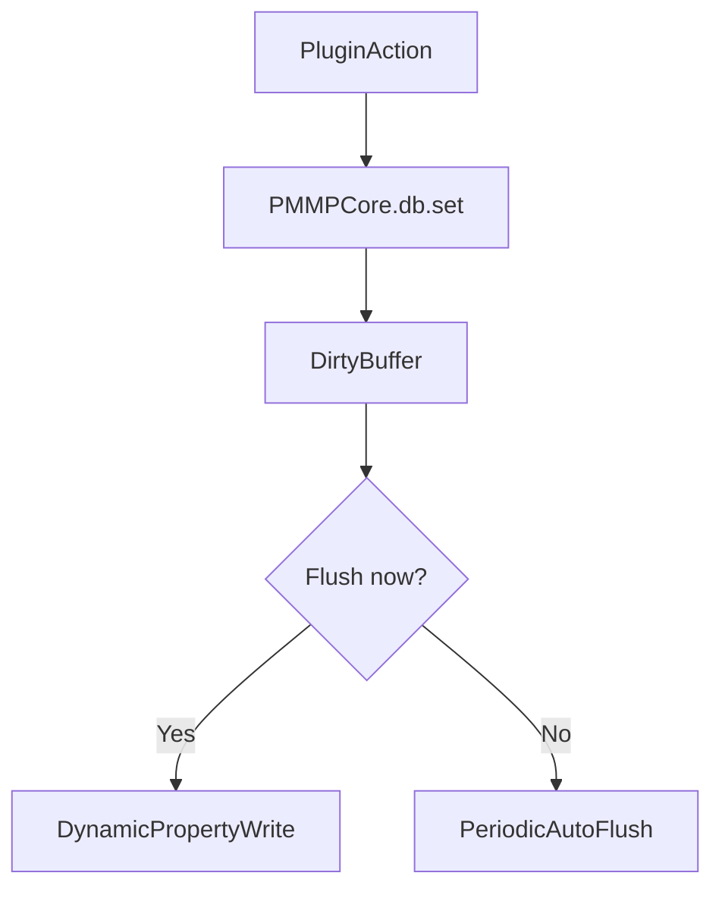
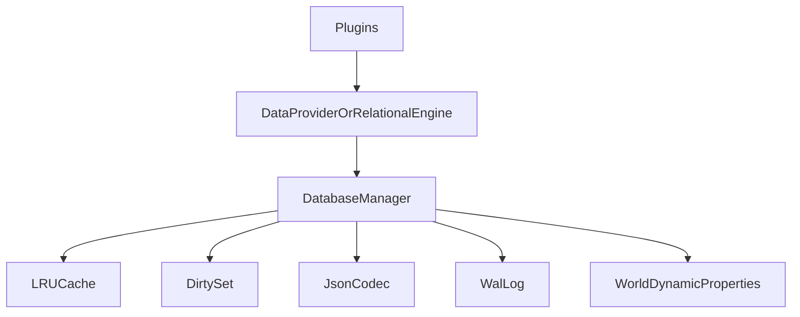
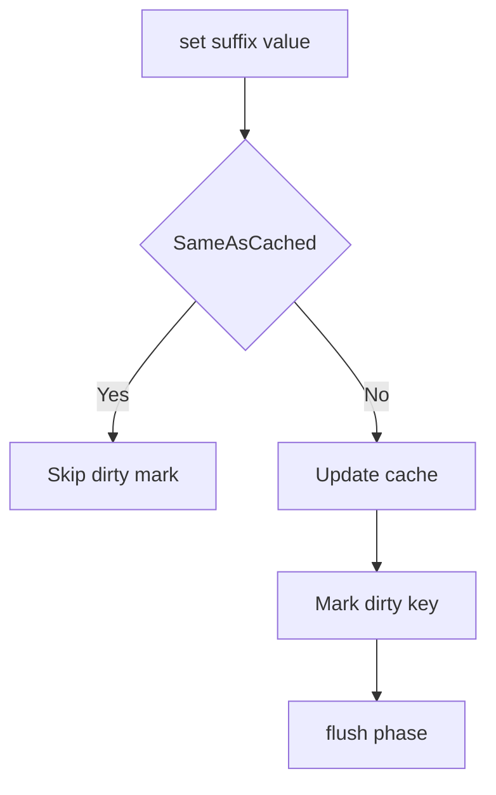
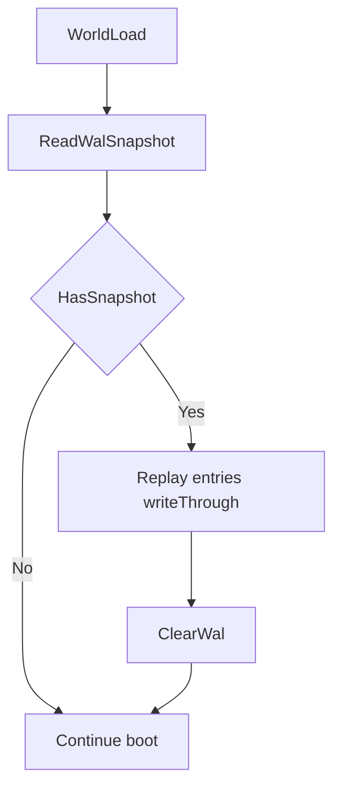
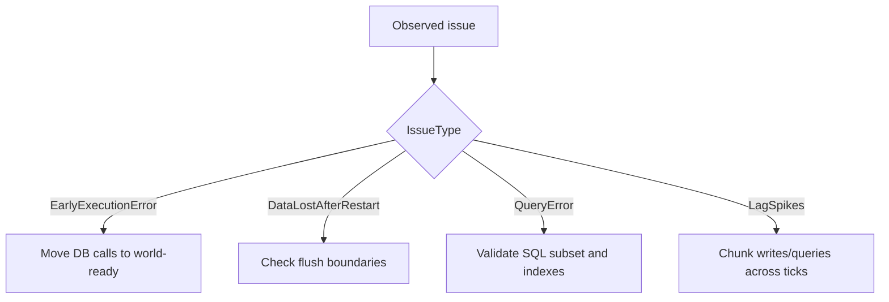

# PMMPCore Database Layer — Developer Guide

Language: **English** | [Español](DATABASE_GUIDE.es.md)

This document is the authoritative reference for persistence in PMMPCore: the key-value store (`DatabaseManager`), the optional PocketMine-style facade (`PMMPDataProvider`), and the relational query layer (`RelationalEngine`). It is written for authors of behavior-pack plugins and for maintainers extending the framework.

---

## Quickstart (entry-level)

If you only need to persist plugin state safely:

1. Read/write through `PMMPCore.db`.
2. Do not touch DB in early execution.
3. Use `onWorldReady()` for first read/write.
4. Call `flush()` after admin-critical writes.



---

## Table of contents

1. [What this is (and is not)](#1-what-this-is-and-is-not)
2. [Architecture](#2-architecture)
3. [Platform constraints](#3-platform-constraints)
4. [When you may call the database](#4-when-you-may-call-the-database)
5. [DatabaseManager (KV core)](#5-databasemanager-kv-core)
6. [Caching, cloning, and flush](#6-caching-cloning-and-flush)
7. [Write-ahead log (WAL)](#7-write-ahead-log-wal)
8. [PMMPDataProvider](#8-pmmpdataprovider)
9. [RelationalEngine](#9-relationalengine)
10. [SQL dialect (supported subset)](#10-sql-dialect-supported-subset)
11. [Key namespaces](#11-key-namespaces)
12. [Diagnostics](#12-diagnostics)
13. [Best practices](#13-best-practices)
14. [Troubleshooting](#14-troubleshooting)
15. [Module imports](#15-module-imports)

---

## 1. What this is (and is not)

**This is:**

- A **single-writer key-value store** backed by Minecraft Bedrock **world Dynamic Properties**, with an in-memory **LRU cache**, a **dirty buffer**, periodic and manual **`flush()`**, and an optional **WAL snapshot** during flush for best-effort recovery.
- An optional **relational layer** with tables, indexes, a **limited SQL-like** `SELECT` surface, and programmatic APIs (`upsert`, `find`, and so on). All relational data still persists through `DatabaseManager`.

**This is not:**

- SQLite, PostgreSQL, or a real SQL engine. There is no SQL wire protocol, no file-based `.db`, no cross-world live replication, and no full ACID guarantees across multiple properties.
- A substitute for external databases. Everything is limited by Bedrock’s Dynamic Property API and world scope.

---

## 2. Architecture

```text
Plugins / RelationalEngine / PMMPDataProvider
                    │
                    ▼
            DatabaseManager
         (cache, dirty, codec, flush, WAL hook)
                    │
                    ▼
      world.getDynamicProperty / setDynamicProperty
```



**Rule:** Application and plugin code should **not** call `world.getDynamicProperty` or `world.setDynamicProperty` for PMMPCore data. Use `PMMPCore.db` (or inject `DatabaseManager`). Internal WAL helpers may touch the world for `pmmpcore:wal:*` only as part of the provided implementation.

---

## 3. Platform constraints

| Constraint | Implication |
|------------|--------------|
| Storage type | Values are stored as **strings** (JSON via `JsonCodec`). |
| Per-property size | Treat **~32,767 characters** as a hard ceiling per Dynamic Property. Shard large payloads across multiple keys (MultiWorld and `RelationalEngine` already do this for big rows). |
| Synchronous API | `setDynamicProperty` is synchronous. Heavy loops that write many keys in one tick can cause frame lag; batch work across ticks where needed. |
| World scope | Scripts only access the **current** world’s Dynamic Properties. “Replication” to another world is **export/import** of key/value snapshots, not live sync. |
| Early execution | During `beforeEvents.startup` / `onStartup`, **Dynamic Property APIs are not available** for normal use. See [section 4](#4-when-you-may-call-the-database). |

---

## 4. When you may call the database

**Do not** read or write `PMMPCore.db` from:

- `system.beforeEvents.startup` handlers (except registering commands and other non–world-IO work), or
- Plugin `onStartup` if it runs in the same early phase where the engine reports *"cannot be used in early execution"*.

**Do** defer first persistence access to:

- `world.afterEvents.worldLoad`, or
- `system.run` / `system.runTimeout` scheduled **after** the world is ready,

following the same pattern as core plugins (e.g. EconomyAPI initializing “after world load”).

Command callbacks and gameplay events generally run outside early execution and may use `PMMPCore.db` freely.

---

## 5. DatabaseManager (KV core)

Access the shared instance as **`PMMPCore.db`** after `PMMPCore.initialize(...)` in `main.js`.

### Constructor options

```javascript
new DatabaseManager({
  cacheLimit: 500,  // optional, default 500 entries (full keys in LRU)
  wal: true,        // optional, default true — WAL snapshot at start of flush
});
```

### Generic key-value API

Keys are **suffixes** without the `pmmpcore:` prefix; the manager prepends `pmmpcore:` internally.

| Method | Description |
|--------|-------------|
| `get(suffix)` | Returns parsed value or `null`. Objects/arrays are **`structuredClone`d** for callers. |
| `set(suffix, value)` | Updates cache, marks key dirty. Persists on next `flush()` (or auto-flush). |
| `delete(suffix)` | Removes from cache and dirty; **immediately** clears the Dynamic Property. |
| `has(suffix)` | True if key exists in cache or on world. |
| `flush()` | Writes all dirty keys to the world; on full success, clears WAL snapshot. Returns `boolean`. |
| `replayWalIfAny()` | Replays a pending WAL snapshot if present (normally invoked from core on `worldLoad`). |
| `listPropertySuffixes(prefix)` | Lists suffixes for keys under `pmmpcore:` matching `prefix` (used by `RelationalEngine`). |

### Player and plugin helpers

| Method | Notes |
|--------|--------|
| `getPlayerData(name)` | Returns `{}` if missing. |
| `setPlayerData(name, data)` | Full document replace for that player key. |
| `getPluginData(pluginName, key?)` | Without `key`, returns whole plugin object; with `key`, returns that field. |
| `setPluginData(pluginName, key, value)` | Sets one field, or pass an object as `key` to shallow-merge. |

### MultiWorld shard helpers

| Method | Storage suffix pattern |
|--------|-------------------------|
| `getWorldIndex()` / `setWorldIndex(names)` | `mw:index` |
| `getWorld(name)` / `setWorld(name, data)` | `mw:world:<name>` |
| `getChunks(name)` / `setChunks(name, keys)` | `mw:chunks:<name>` |
| `deleteWorld(name)` | Deletes world + chunks keys. |

MultiWorld’s `flushWorldData()` ends with **`PMMPCore.db.flush()`** so world state is not left only in RAM.

### Statistics

`getStats()` returns:

- `totalKeys`, `estimatedSize` (character count estimate),
- `keys` (suffix list),
- `dirtyKeys` (count of pending writes).

Useful for `/info` and capacity monitoring.

---

## 6. Caching, cloning, and flush

- **`get`** returns a **clone** of objects and arrays. Mutating the return value does **not** persist. Always call **`set`** (or a helper) after changes.
- **`set`** skips marking dirty if `JSON.stringify` compares equal to the cached value (micro-optimization).
- **Auto-flush:** `main.js` registers `system.runInterval` (default **120 ticks**) calling `PMMPCore.db.flush()`.
- **Manual flush:** Call `PMMPCore.db.flush()` after critical batches or before relying on data surviving a sudden process exit.

---

## 6.1 Write path details



---

## 7. Write-ahead log (WAL)

**Purpose:** Best-effort recovery if the game stops between writing the WAL snapshot and finishing all dirty writes in a single `flush()` pass.

**Behavior:**

1. When `flush()` runs with dirty keys and WAL is enabled, a JSON snapshot of `{ suffix, value }[]` is written to `pmmpcore:wal:0` (or `:1` if the payload is oversized/truncated).
2. Each dirty key is then written to its Dynamic Property.
3. If all writes succeed, WAL keys are cleared.

On **`world.afterEvents.worldLoad`**, the core calls **`replayWalIfAny()`**: if a snapshot exists, entries are applied via **`_writeThrough`** and WAL is cleared.

**Testing WAL:** Deliberately aborting `flush()` immediately after `writeSnapshot` (development-only) is the reliable way to exercise replay; killing the client at random timing is not.

**Limitations:** Not a transactional log; no guarantee against partial multi-key corruption if failure occurs mid-flush without a valid snapshot.

---

## 7.1 WAL replay flow



---

## 8. PMMPDataProvider

Thin PocketMine-style facade over `DatabaseManager`. Obtain with:

```javascript
const dp = PMMPCore.getDataProvider();
if (!dp) return; // core not initialized
dp.loadPlayer(name);
dp.savePlayer(name, data);
dp.existsPlayer(name);
dp.deletePlayer(name);
dp.loadPluginData("MyPlugin");
dp.savePluginData("MyPlugin", data);
dp.get(key); dp.set(key, v); dp.exists(key); dp.delete(key);
dp.flush();
```

No additional persistence path; suitable for plugins that prefer naming aligned with PMMP idioms.

---

## 9. RelationalEngine

Obtained via:

```javascript
const rel = PMMPCore.createRelationalEngine();
```

Requires `PMMPCore` initialized. Uses **only** `DatabaseManager` for I/O; storage prefix for relational metadata and rows is **`rtable:`** (under `pmmpcore:`).

### Minimal example (worldLoad-safe)

```javascript
import { world } from "@minecraft/server";
import { PMMPCore } from "./PMMPCore.js";

world.afterEvents.worldLoad.subscribe(() => {
  const rel = PMMPCore.createRelationalEngine();
  rel.createTable("items", {});
  rel.createIndex("items", "kind");
  rel.upsert("items", "pickaxe_1", { kind: "tool", tier: 2 });
  PMMPCore.db.flush();
});
```

Do not place this logic in `onStartup` (early execution). Subscribe once or guard with a module flag if you only want it to run a single time per session.

### Tables and schema

```javascript
rel.createTable("players", { money: "number", rank: "string" });
```

`schema` is descriptive metadata; validation is not enforced as strictly as a SQL DDL engine.

### Row operations

| Method | Description |
|--------|-------------|
| `upsert(table, id, data)` | Merges `{ id, ...data }`. Updates indexes; shards row JSON if over ~28k characters. |
| `getRow(table, id)` | Returns row object or `null`. |
| `deleteRow(table, id)` | Removes row shards, rowmeta, and index entries. |

### Indexes

- **Simple:** `createIndex(table, field)` — required for `find(table, { field: value })` on that field.
- **Composite:** `createCompositeIndex(table, ["f1", "f2"])` — use with `findComposite(table, ["f1","f2"], [v1, v2])`.

Indexes are maintained on **upsert** and **delete** by removing old row values and inserting new ones (consistency-first design).

### Queries (programmatic)

| Method | Description |
|--------|-------------|
| `findAll(table)` | Full table scan via `listPropertySuffixes`. |
| `find(table, { field: value })` | Uses simple index; throws if index missing. |
| `findComposite(table, fields, values)` | Uses composite index. |

### Migrations and analysis

```javascript
rel.migrate(1, (engine) => {
  engine.createTable("ledger", {});
});
rel.analyze("players"); // builds sampled stats for planner; >1000 rows uses sampling
```

### SQL interface

- **`executeQuery(sql)`** — synchronous; fine for modest row counts.
- **`executeQueryAsync(sql, system, onDone, chunkSize?)`** — filters large scans in chunks with `system.run` to reduce tick spikes.

### Materialized views

```javascript
rel.createMaterializedView("rich", `SELECT * FROM players WHERE money > 1000`);
rel.getMaterializedView("rich");
rel.refreshMaterializedView("rich");
```

### Query cache

Repeated identical normalized SQL strings hit an in-memory cache. **Any** `upsert` or `deleteRow` **clears** the entire query cache (simple invalidation).

---

## 10. SQL dialect (supported subset)

The parser is intentionally small. Features **not** listed here should be treated as **unsupported** unless you verify in source (`scripts/db/RelationalEngine.js`).

**Supported (typical):**

- `SELECT *` or `SELECT col1, col2, COUNT(*), SUM(col)`
- `FROM table`
- `WHERE` with `AND` / `OR`, operators `=`, `!=`, `>`, `<`, `>=`, `<=`
- String literals in single or double quotes
- `INNER JOIN table ON left = right` (also `JOIN`); join keys may use `table.column` form
- `GROUP BY field` with `COUNT(*)`, `SUM(field)` in select list
- `ORDER BY field ASC|DESC`
- `LIMIT n`, `OFFSET n`

**Heuristic planner:** Equality on an indexed field may seed the row set before filtering remaining predicates. Call `analyze(table)` for better selectivity hints on large tables.

**Not supported:** Subqueries, `HAVING`, `UNION`, DDL strings (`CREATE TABLE` as SQL), transactions, cursors, most built-in functions.

---

## 11. Key namespaces

| Prefix (suffix start) | Owner |
|----------------------|--------|
| `player:` | Per-player documents |
| `plugin:` | Per-plugin blob |
| `mw:` | MultiWorld index, worlds, chunks |
| `rtable:` | RelationalEngine metadata, rows, indexes, views |
| `wal:` | WAL shards (internal) |

Avoid manual collisions; use `plugin:YourPluginName` or dedicated `rtable:` tables for new features.

---

## 12. Diagnostics

- In-game: **`/info`** — plugins, DB key count, estimated size, **dirty** count.
- Logs: watch for **`[DB]`** prefix (`flush error`, `decode`, WAL replay).

---

## 13. Best practices

1. **Defer DB I/O** until `worldLoad` or later (see [section 4](#4-when-you-may-call-the-database)).
2. **Call `flush()`** after bulk writes when players expect immediate durability (or rely on MultiWorld’s flush for world data).
3. **Keep documents small** per property; shard large arrays (chunk lists, big tables) across keys.
4. **Prefer indexes** before using `find` / SQL filters that assume index presence.
5. **Use `executeQueryAsync`** when scanning large tables on low-end devices.
6. **Version migrations** with `rel.migrate(n, fn)` or your own `plugin:meta` version key.

---

## 14. Troubleshooting

| Symptom | Check |
|---------|--------|
| *Early execution* error | Move code to `worldLoad` or `system.run`. |
| Data reverts after exit | Ensure `flush()` ran; increase flush frequency or flush after writes. |
| `find` throws “No index” | `createIndex` for that field first. |
| SQL parse error | Compare query to [section 10](#10-sql-dialect-supported-subset). |
| High dirty count | Normal under heavy write load until next auto-flush; verify interval in `main.js`. |

---

## 14.1 Troubleshooting decision tree



---

## 15. Module imports

```javascript
import { DatabaseManager } from "./DatabaseManager.js";
import { PMMPDataProvider } from "./PMMPDataProvider.js";
import { RelationalEngine, JsonCodec, WalLog } from "./db/index.js";
```

For third-party plugins inside this pack, paths are usually relative to `scripts/` (e.g. `"../../db/index.js"` from `scripts/plugins/MyPlugin/`).

---

*This guide reflects the implementation shipped with PMMPCore. When in doubt, prefer the source of truth in `DatabaseManager.js`, `PMMPDataProvider.js`, and `db/RelationalEngine.js`.*
