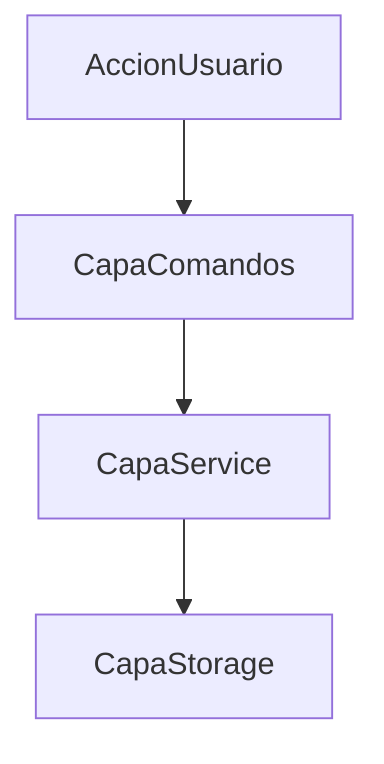

# Plantilla oficial de documentación de plugins

Idioma: **Español** | [English](PLUGIN_DOC_TEMPLATE.md)

Usa esta plantilla para cada documento nuevo de plugin en `docs/plugins/`.

---

## Barra de calidad documental (obligatoria)

Toda documentación de plugin debe incluir:

- onboarding para usuarios entry-level,
- ejemplos accionables (no solo teoría),
- troubleshooting por síntoma -> causa -> solución,
- límites y notas operativas,
- múltiples diagramas Mermaid en docs técnicos.

Mínimo Mermaid requerido:

- 1 flujo de arquitectura,
- 1 flujo runtime/comandos,
- 1 árbol de decisión de troubleshooting.

## 1) Encabezado

- Nombre del plugin
- Versión
- Maintainer/equipo
- Estado (`stable` / `experimental` / `internal`)

## 2) Objetivo y alcance

- Qué problema resuelve
- Qué hace y qué no hace
- Audiencia objetivo (admin/dev/jugador)

## 3) Instalación y habilitación

- Ubicación de carpetas
- Imports/registros requeridos
- Dependencias obligatorias (`depend`) y opcionales (`softdepend`)

## 4) Inicio rápido (primeros 5 minutos)

- Comandos mínimos para verificar funcionamiento
- Resultado esperado

## 5) Referencia de configuración (propiedad por propiedad)

Documenta cada clave relevante:

- nombre de clave
- tipo
- valor por defecto
- valores/rangos permitidos
- efecto
- ejemplo

## 6) Referencia de comandos

Por comando:

- sintaxis completa
- aliases (si aplica)
- nodos de permiso requeridos
- ejemplos
- errores comunes

## 7) Modelo de permisos

- lista completa de nodos
- defaults de roles sugeridos
- estrategia recomendada de seed (si aplica)

## 8) Modelo de datos y persistencia

- claves/prefijos de storage
- cuándo lee/escribe
- operaciones sensibles a flush
- notas de migración/versionado

## 9) Integración con lifecycle

- qué hace en `onLoad`
- `onEnable`
- `onStartup`
- `onWorldReady`
- `onDisable`

## 10) Notas operativas y rendimiento

- operaciones pesadas y safeguards
- uso de scheduler
- límites esperados (si se conocen)

## 11) Troubleshooting

- síntomas comunes
- causas probables
- chequeos
- soluciones

## 12) FAQ

- 5-10 preguntas cortas frecuentes de admins/devs

## 13) Changelog / notas de migración

- cambios de comportamiento/data por versión

## 14) Diagramas Mermaid (obligatorio)

- Flujo de arquitectura (componentes y responsabilidades)
- Flujo runtime (arranque, comandos, persistencia)
- Árbol de troubleshooting

Snippets base:



```mermaid
flowchart TD
  symptom[SintomaObservado] --> class{ClaseSintoma}
  class -->|CategoriaA| checkA[ChequeoA]
  class -->|CategoriaB| checkB[ChequeoB]
  class -->|CategoriaC| checkC[ChequeoC]
```

---

## Esqueleto listo para copiar

```markdown
# Documentación de <NombrePlugin>

Idioma: **Español** | [English](<FILE>.md)

## 1. Objetivo y alcance
...

## 2. Instalación
...

## 3. Inicio rápido
...

## 4. Referencia de configuración
...

## 5. Comandos
...

## 6. Permisos
...

## 7. Persistencia
...

## 8. Comportamiento por lifecycle
...

## 9. Troubleshooting
...

## 10. FAQ
...
```

### Esqueleto extendido (recomendado)

```markdown
## 11. Límites y cuotas
...

## 12. Árbol de troubleshooting
```mermaid
flowchart TD
  symptom[Sintoma] --> class{Clase}
  class -->|A| actionA[AccionA]
  class -->|B| actionB[AccionB]
```
```
