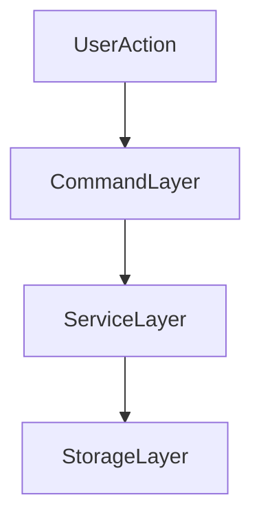

# Plugin Documentation Template (Official)

Language: **English** | [Español](PLUGIN_DOC_TEMPLATE.es.md)

Use this template for every new plugin document under `docs/plugins/`.

---

## Documentation quality bar (mandatory)

Every plugin document must include:

- onboarding section for entry-level users,
- actionable examples (not conceptual only),
- troubleshooting with symptom -> cause -> fix,
- limits and operational caveats,
- multiple Mermaid diagrams for technical docs.

Minimum Mermaid requirement:

- 1 architecture flow,
- 1 runtime/command flow,
- 1 troubleshooting decision tree.

## 1) Header

- Plugin name
- Version
- Maintainer/team
- Status (`stable` / `experimental` / `internal`)

## 2) Purpose and scope

- What problem the plugin solves
- What it does and does not do
- Intended audience (admin/dev/player-facing)

## 3) Installation and enablement

- Folder location
- Required imports/registration points
- Required dependencies (`depend`) and optional ones (`softdepend`)

## 4) Quickstart (first 5 minutes)

- Minimal commands to verify plugin works
- Expected output/behavior

## 5) Configuration reference (property by property)

Document every relevant config key:

- key name
- type
- default value
- allowed values/range
- effect
- example

## 6) Command reference

Per command:

- full syntax
- aliases (if any)
- required permission nodes
- examples
- common mistakes

## 7) Permission model

- full node list
- intended role defaults
- recommended seeding strategy (if plugin seeds nodes)

## 8) Data and persistence model

- storage keys/prefixes
- when data is read/written
- flush-sensitive operations
- migration/versioning notes

## 9) Lifecycle integration

- what plugin does in `onLoad`
- `onEnable`
- `onStartup`
- `onWorldReady`
- `onDisable`

## 10) Performance and operational notes

- heavy operations and safeguards
- scheduler usage
- expected scale limits (if known)

## 11) Troubleshooting

- common symptoms
- likely causes
- checks
- fixes

## 12) FAQ

- 5-10 short questions most admins/devs ask

## 13) Changelog / migration notes

- version-to-version behavior/data changes

## 14) Mermaid diagrams (required)

- Architecture flow (components and responsibilities)
- Runtime flow (startup, command handling, persistence path)
- Troubleshooting decision tree

Template snippets:



```mermaid
flowchart TD
  symptom[ObservedSymptom] --> class{SymptomClass}
  class -->|CategoryA| checkA[CheckA]
  class -->|CategoryB| checkB[CheckB]
  class -->|CategoryC| checkC[CheckC]
```

---

## Ready-to-copy skeleton

```markdown
# <Plugin Name> Documentation

Language: **English** | [Español](<FILE>.es.md)

## 1. Purpose and scope
...

## 2. Installation
...

## 3. Quickstart
...

## 4. Configuration reference
...

## 5. Commands
...

## 6. Permissions
...

## 7. Persistence
...

## 8. Lifecycle behavior
...

## 9. Troubleshooting
...

## 10. FAQ
...
```

### Extended skeleton (recommended)

```markdown
## 11. Limits and quotas
...

## 12. Troubleshooting decision tree
```mermaid
flowchart TD
  symptom[ObservedSymptom] --> class{Class}
  class -->|A| actionA[ActionA]
  class -->|B| actionB[ActionB]
```
```
