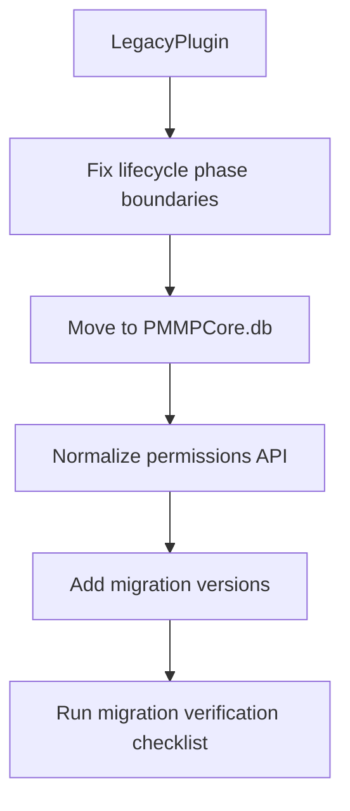
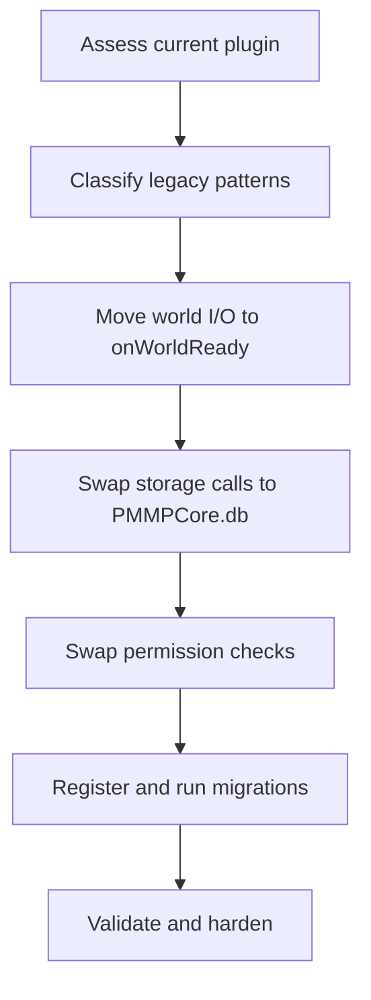

# Plugin Migration Guide to PMMPCore API v1

Language: **English** | [Español](PLUGIN_MIGRATION_GUIDE.es.md)

This guide helps you migrate existing plugins (legacy patterns) to the PMMPCore v1-style API with minimum regressions.

---

## Migration quick path

If you only need the safest migration sequence:

1. Move startup DB logic to `onWorldReady`.
2. Replace direct Dynamic Property usage with `PMMPCore.db`.
3. Replace backend-specific permission checks with `getPermissionService()`.
4. Add versioned migration steps.
5. Validate with restart and command smoke tests.



---

## 1) Why migrate

Migrating to PMMPCore v1 patterns gives you:

- lifecycle-safe world access (`onWorldReady`)
- centralized persistence (`PMMPCore.db` + optional migration service)
- stable permission abstraction (`getPermissionService()`)
- clearer command boundaries (`onStartup`)
- better maintainability and compatibility across ecosystem plugins

---

## 2) Legacy -> v1 mapping (quick table)

- Early DB reads in startup -> move to `onWorldReady()`
- Direct Dynamic Property access -> use `PMMPCore.db`
- Direct PurePerms internals -> use `PMMPCore.getPermissionService()`
- Ad-hoc intervals/timeouts -> use `PMMPCore.getScheduler()`
- Implicit schema upgrades -> explicit `MigrationService` registration + `run(...)`
- Mixed startup responsibilities -> split:
  - `onStartup(event)` for command/enum registration
  - `onWorldReady()` for data hydration and runtime world logic

---

## 3) Migration strategy (recommended order)

1. **Stabilize lifecycle first**
2. **Migrate persistence paths**
3. **Migrate permission checks**
4. **Introduce migrations**
5. **Adopt scheduler/event bus where useful**
6. **Run validation checklist**

This order reduces the chance of silent data or permission regressions.

---

## 3.1 Risk map by migration stage

| Stage | Primary risk | Primary mitigation |
|---|---|---|
| Lifecycle | early execution runtime errors | split startup/world-ready concerns |
| Persistence | data mismatch or data loss | explicit read/write mapping + flush boundaries |
| Permissions | accidental privilege changes | centralized guard helper and node audit |
| Migrations | repeated transform or corruption | idempotent migration logic and version checks |

---

## 4) Step-by-step migration playbook

## Step A: Normalize plugin registration

Keep registration in `PMMPCore.registerPlugin(...)`, ensure:

- `name` and `version` are present
- `depend: ["PMMPCore"]` is declared for strict core dependency

In `onEnable()`, create plugin context:

```javascript
this.context = PMMPCore.getPluginContext("MyPlugin", "1.0.0");
```

## Step B: Move startup logic to the correct lifecycle phase

### Keep in `onStartup(event)`

- command enum registration
- command registration
- non-world bootstrap that does not touch Dynamic Properties

### Move to `onWorldReady()`

- first DB reads/writes
- relational engine warmup
- data hydration and cache preload
- migration execution

Reason: avoid Bedrock early-execution errors.

## Step C: Replace direct persistence calls

### Before (legacy style)

```javascript
world.setDynamicProperty("myplugin:data", JSON.stringify(data));
```

### After (v1 style)

```javascript
PMMPCore.db.setPluginData("MyPlugin", "data", data);
PMMPCore.db.flush();
```

Rules:

- never mutate `get()` result without writing back via `set()`
- flush after critical writes that must survive abrupt stops

## Step D: Migrate permissions to stable service API

### Before

- plugin fetches PurePerms internals directly and calls backend-specific methods

### After

```javascript
const perms = PMMPCore.getPermissionService();
const allowed = perms?.has(player.name, "pperms.command.myplugin.admin", player.dimension?.id ?? null, player);
```

Benefits:

- backend-independent checks
- cleaner fallback behavior
- lower coupling to a specific plugin internals shape

## Step E: Add schema/data migrations

Register in `onEnable()`, run in `onWorldReady()`:

```javascript
onEnable() {
  PMMPCore.getMigrationService()?.register("MyPlugin", 1, () => {
    PMMPCore.db.setPluginData("MyPlugin", "schema", { version: 1 });
  });
}

onWorldReady() {
  PMMPCore.getMigrationService()?.run("MyPlugin");
}
```

Migration best practices:

- idempotent operations only
- no destructive rewrites unless unavoidable
- log each applied version

## Step F: Optional modernization

Adopt:

- `getScheduler()` for repeating/delayed work with tick budgeting
- `getEventBus()` for decoupled plugin-to-plugin event contracts

---

## 4.1 End-to-end migration flow



---

## 5) Real-world migration examples

## Example 1: startup crash due to early execution

Symptom:

- `cannot be used in early execution`

Fix:

- move DB code from `onStartup` to `onWorldReady`
- keep only command registration in startup

## Example 2: permission regressions after refactor

Symptom:

- admins lose access or checks become inconsistent

Fix:

- use a single helper around `PMMPCore.getPermissionService()`
- keep permission node names stable
- audit command guards one-by-one

## Example 3: data shape changes across plugin updates

Symptom:

- old worlds load with partial/null data

Fix:

- add versioned migrations
- transform legacy keys in migration steps
- write compatibility defaults explicitly

---

## 6) Migration verification checklist

- [ ] Plugin loads and enables without dependency warnings (except expected soft dependencies)
- [ ] No DB/world access in early startup paths
- [ ] Commands register in `onStartup(event)` and execute correctly
- [ ] First data hydration happens in `onWorldReady()`
- [ ] Permission checks use `getPermissionService()`
- [ ] Migrations are registered and executed exactly once per version
- [ ] Critical writes call `PMMPCore.db.flush()` where needed
- [ ] `/diag` shows healthy platform status after plugin load

---

## 6.1 Verification runbook

1. Fresh world load test.
2. Restart world and verify no repeated migration application.
3. Command smoke test for all changed commands.
4. Permission-denied path test (negative test).
5. Data durability test (write -> flush -> restart -> read).

---

## 7) Common pitfalls

- Migrating command logic but forgetting enum registration
- Running migrations before world-ready phase
- Using both direct world Dynamic Property writes and PMMPCore DB for same data domain
- Non-idempotent migrations that duplicate entries on reboot

---

## 8) Suggested rollout approach

1. Create migration branch.
2. Port one plugin subsystem at a time (commands, data, permissions).
3. Validate after each subsystem.
4. Run end-to-end smoke test in world.
5. Ship with explicit release notes (“what changed in lifecycle/data/permissions”).

---

## 9) FAQ

### Do I need to migrate everything at once?

No. A phased migration is safer: lifecycle first, then persistence, then permissions, then optional services.

### Can I keep legacy keys while migrating?

Yes, temporarily. Add compatibility reads and move values into the new schema through versioned migrations.

### What is the most common migration failure?

Running DB logic in startup-early phase. Always move data hydration to `onWorldReady()`.

### Should migrations call external plugin APIs?

Prefer not to. Keep migrations deterministic and focused on your plugin-owned data.

### How do I prove migration is safe?

Run a first-load test, restart test, and rollback/forward test using `/diag` plus plugin command smoke tests.

### Should I migrate command UX while migrating internals?

Prefer keeping command UX stable during migration and improving UX in a separate pass, so regressions are easier to isolate.
