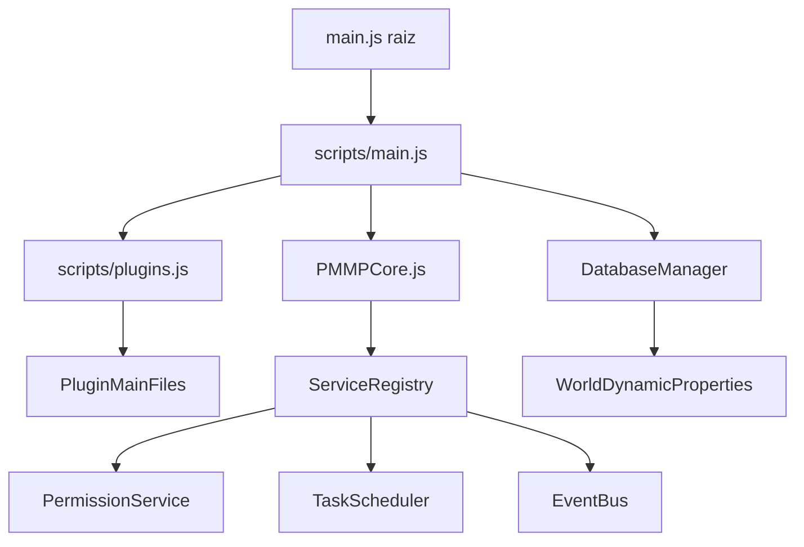
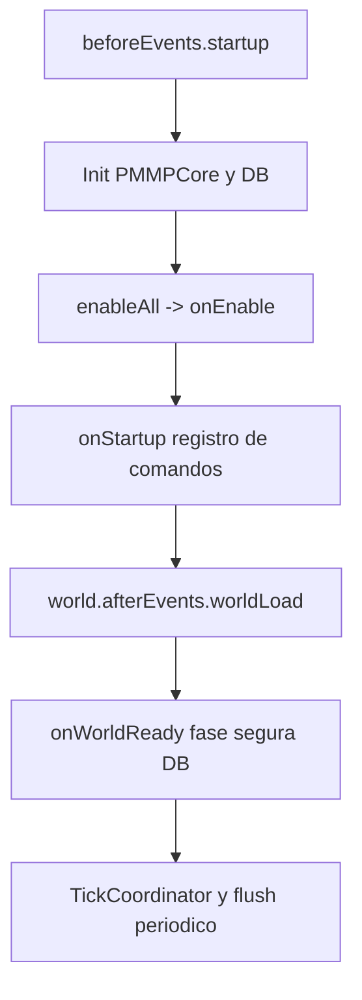
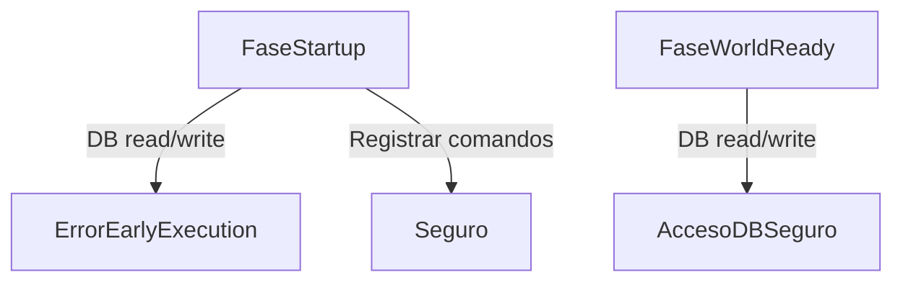
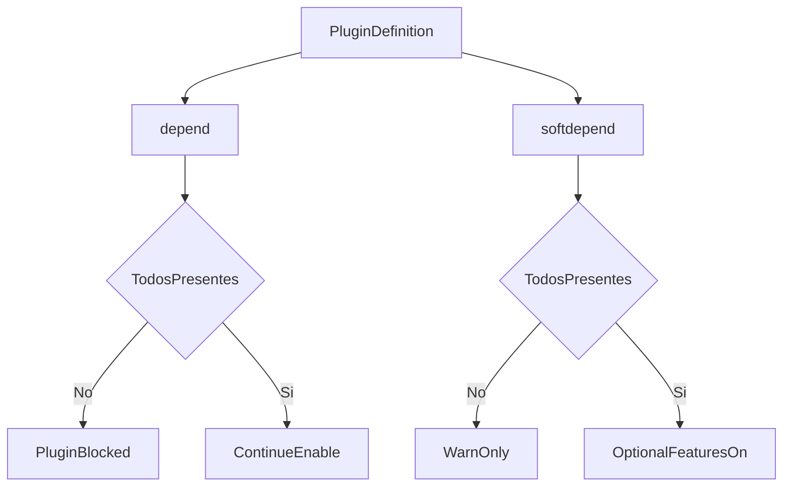
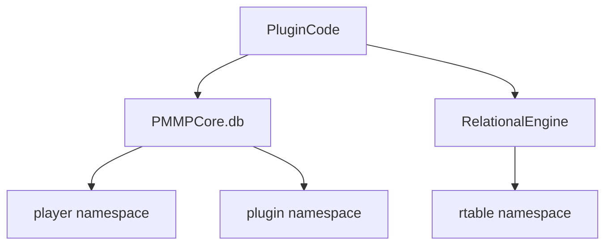

# PMMPCore - Documentación del Proyecto

Idioma: [English](PROJECT_DOCUMENTATION.md) | **Español**

## 1. Para qué existe PMMPCore

PMMPCore es un framework para Behavior Packs de Bedrock que permite desarrollar plugins con un modelo consistente de lifecycle, persistencia, permisos, comandos y observabilidad.

Si vienes a evaluarlo rápido:

- Tiene ciclo de vida estándar.
- Tiene una ruta de persistencia única (`PMMPCore.db`).
- Tiene servicios reutilizables (migraciones, scheduler, eventos, permisos).
- Incluye plugins core listos para usar.

## 2. Vista rápida de arquitectura

## 3. Flujo runtime (clave)

Contrato de lifecycle por plugin:

- `onLoad()`: opcional, sin I/O de mundo.
- `onEnable()`: suscripciones y setup.
- `onStartup(event)`: comandos/enums únicamente.
- `onWorldReady()`: primer punto seguro para DB/migraciones.
- `onDisable()`: limpieza + cierre seguro.

## 4. Seguridad de early execution

Dynamic Properties no están disponibles en fases tempranas, por lo que `PMMPCore.db` tampoco debe usarse ahí.

Regla práctica:

- En `onStartup`: registrar comandos.
- En `onWorldReady`: hidratar estado, migrar y persistir.

## 5. Componentes y responsabilidades

- `scripts/main.js`: orquestación de arranque y puente a world-ready.
- `scripts/PMMPCore.js`: registro plugins, validación dependencias y acceso a servicios.
- `scripts/DatabaseManager.js`: KV, caché LRU, dirty buffer, flush, WAL replay.
- `scripts/plugins.js`: orden de carga de plugins.
- `scripts/api/index.js`: exports públicos curados.

## 6. Estrategia de dependencias

`depend` (obligatoria):

- si falta, el plugin queda bloqueado.

`softdepend` (opcional):

- si falta, el plugin sigue activo con degradación funcional.

## 7. Vista de datos

Namespaces principales:

- `pmmpcore:player:<name>`
- `pmmpcore:plugin:<pluginName>`
- `pmmpcore:mw:*`
- `pmmpcore:rtable:*`

## 8. Observabilidad operativa

Comandos útiles:

- `pmmpcore:plugins`
- `pmmpcore:pluginstatus`
- `pmmpcore:diag`
- `pmmpcore:info`
- `pmmpcore:selftest`

Objetivo: reducir diagnóstico por intuición y hacerlo reproducible.

## 9. Casos comunes

### Caso A: autor de plugin nuevo

1. Crea `scripts/plugins/MyPlugin/main.js`.
2. Registra con `depend: ["PMMPCore"]`.
3. Comandos en `onStartup`.
4. DB/migraciones en `onWorldReady`.
5. Añade import en `scripts/plugins.js`.

### Caso B: plugin con economía opcional

1. `softdepend: ["EconomyAPI"]`.
2. Resolver plugin con `PMMPCore.getPlugin("EconomyAPI")`.
3. Si no existe, degradar solo features económicas.

## 10. Fallos frecuentes

- DB en `onStartup` -> mover a `onWorldReady`.
- Comando sin namespace -> usar `pmmpcore:<nombre>`.
- Lógica en callback de comando -> mover a `service.js`.
- Dependencia no declarada -> añadir `depend`/`softdepend`.

## 11. Orientación de roadmap

Corto plazo:

- robustez operativa,
- consistencia de observabilidad,
- calidad documental.

Mediano plazo:

- plantillas/scaffolding para plugins,
- regresión de comandos críticos.

Largo plazo:

- madurez de API estable,
- contratos de ecosistema más sólidos.

## 12. Lecturas siguientes

- [Guía API pública](API_PUBLIC_GUIDE.es.md)
- [Guía de base de datos](DATABASE_GUIDE.es.md)
- [Guía de desarrollo de plugins](PLUGIN_DEVELOPMENT_GUIDE.es.md)
- [Guía de migración](PLUGIN_MIGRATION_GUIDE.es.md)
- [Playbook de troubleshooting](TROUBLESHOOTING_PLAYBOOK.es.md)

