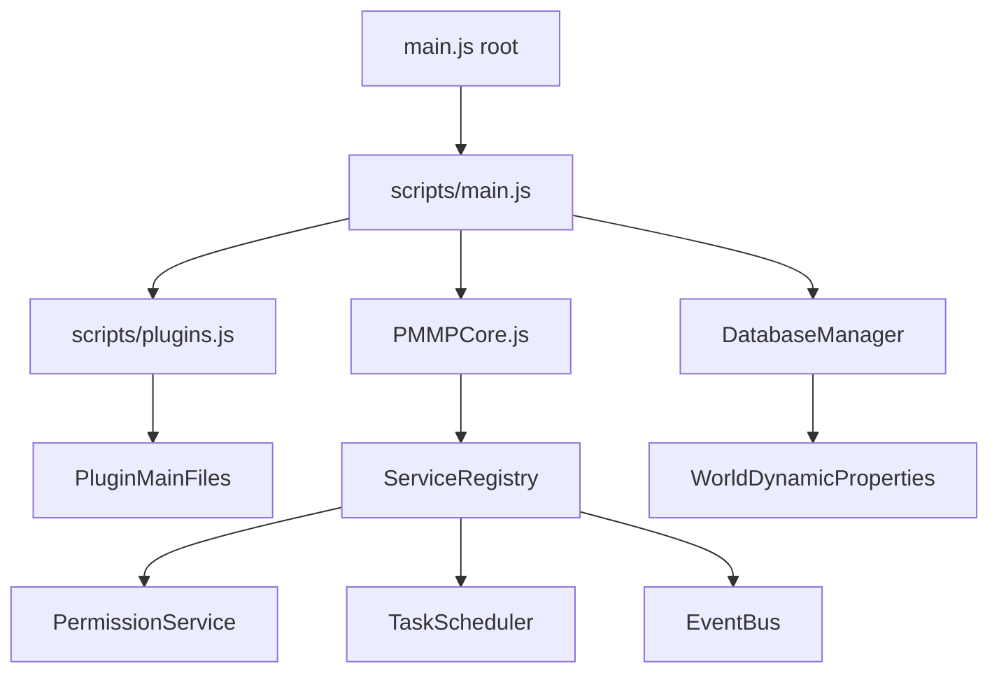
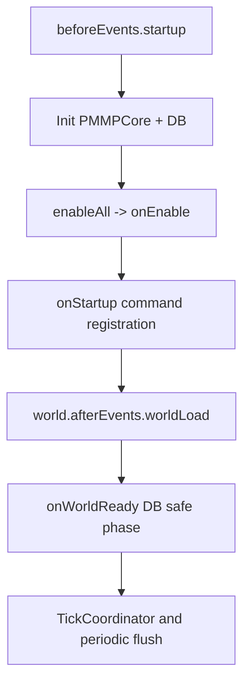
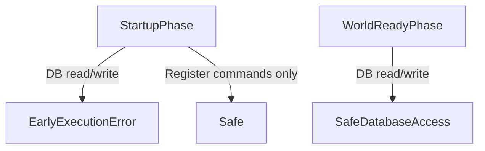
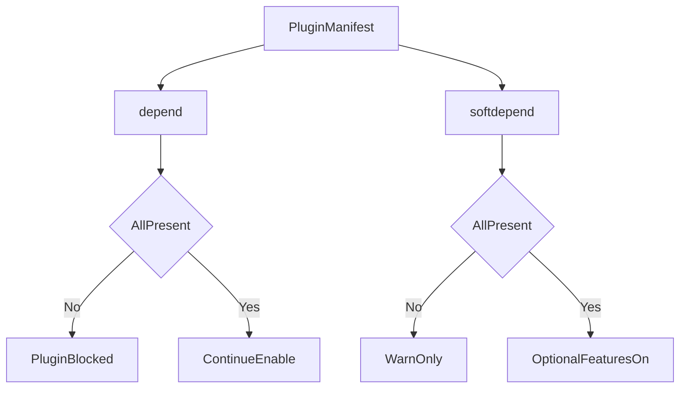
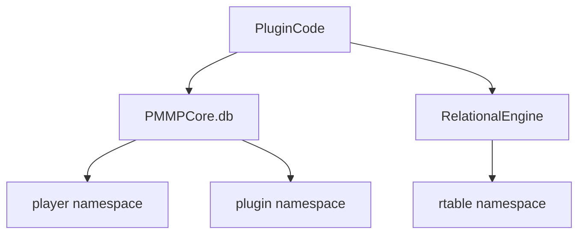

# PMMPCore - Project Documentation

Language: **English** | [Español](PROJECT_DOCUMENTATION.es.md)

## 1. Why PMMPCore exists

PMMPCore is a Bedrock Behavior Pack framework that gives plugin authors a predictable way to ship modular features without reinventing lifecycle, storage, permission checks, and diagnostics every time.

If you are evaluating PMMPCore quickly:

- You get a unified plugin lifecycle.
- You get one central persistence path (`PMMPCore.db`).
- You get reusable services (permissions, migrations, scheduler, events).
- You get a curated plugin ecosystem (`MultiWorld`, `PurePerms`, `PureChat`, `PlaceholderAPI`, `EconomyAPI`).

## 2. Quickstart Architecture View

## 3. Runtime lifecycle (the critical part)

Lifecycle contract per plugin:

- `onLoad()`: optional, no world I/O.
- `onEnable()`: subscriptions and setup.
- `onStartup(event)`: register commands/enums only.
- `onWorldReady()`: first safe DB/migration phase.
- `onDisable()`: cleanup + final durability-sensitive actions.

## 4. Early execution safety

`PMMPCore.db` uses Dynamic Properties under the hood.  
Dynamic Properties are unavailable in early execution phases, so DB reads/writes must be deferred to world-ready flow.

Practical rule:

- In `onStartup`: register command signatures only.
- In `onWorldReady`: hydrate state, run migrations, query/persist data.

## 5. Core modules and responsibilities

- `scripts/main.js`: startup orchestration, world-ready bridge, diagnostics commands.
- `scripts/PMMPCore.js`: plugin registry, dependency validation, service accessors.
- `scripts/DatabaseManager.js`: KV store, cache, dirty buffer, flush, WAL replay.
- `scripts/plugins.js`: static plugin import list and loading order.
- `scripts/api/index.js`: curated public exports for plugin authors.

## 6. Dependency strategy

Hard dependency (`depend`):

- missing dependency blocks plugin enable.

Soft dependency (`softdepend`):

- plugin still enables, but must gracefully degrade optional paths.

## 7. Data model overview

Primary namespaces:

- `pmmpcore:player:<name>`
- `pmmpcore:plugin:<pluginName>`
- `pmmpcore:mw:*`
- `pmmpcore:rtable:*` (relational)

## 8. Observability and operational control

Use platform commands:

- `pmmpcore:plugins`, `pmmpcore:pluginstatus`
- `pmmpcore:diag`
- `pmmpcore:info`
- `pmmpcore:selftest`

These commands are meant to reduce guesswork during production debugging.

## 9. Common use cases

### Use case A: new plugin author onboarding

1. Create `scripts/plugins/MyPlugin/main.js`.
2. Register plugin with `depend: ["PMMPCore"]`.
3. Put command registration in `onStartup`.
4. Put DB access in `onWorldReady`.
5. Add import to `scripts/plugins.js`.

### Use case B: plugin with optional economy

1. Add `softdepend: ["EconomyAPI"]`.
2. Resolve plugin at runtime with `PMMPCore.getPlugin("EconomyAPI")`.
3. If missing, disable only economy-specific features.

## 10. Frequent failure patterns

- DB access in `onStartup` -> move to `onWorldReady`.
- Non-namespaced command names -> use `pmmpcore:<name>`.
- Business logic inside command callback -> move to service layer.
- Missing dependency declaration -> add explicit `depend`/`softdepend`.

## 11. Roadmap orientation

Short term:

- reliability hardening,
- observability consistency,
- plugin docs quality.

Medium term:

- more reusable plugin scaffolding,
- regression checks for critical commands.

Long term:

- stable API policy enforcement,
- ecosystem-level plugin contracts.

## 12. Where to continue

- [Public API guide](API_PUBLIC_GUIDE.md)
- [Database guide](DATABASE_GUIDE.md)
- [Plugin development guide](PLUGIN_DEVELOPMENT_GUIDE.md)
- [Migration guide](PLUGIN_MIGRATION_GUIDE.md)
- [Troubleshooting playbook](TROUBLESHOOTING_PLAYBOOK.md)
