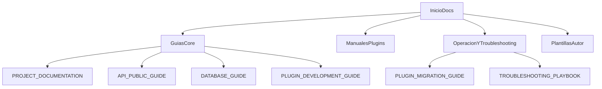

# Documentación PMMPCore

Idioma: [English](README.md) | **Español**

Índice oficial y punto de entrada para navegar toda la documentación de PMMPCore.

## Mapa de documentación

## Documentos

- `PROJECT_DOCUMENTATION.es.md` - arquitectura, runtime, persistencia y roadmap técnico.
- `DATABASE_GUIDE.es.md` - **capa de base de datos**: `DatabaseManager`, `PMMPDataProvider`, `RelationalEngine`, WAL, subconjunto SQL, límites y buenas prácticas (inglés: `DATABASE_GUIDE.md`).
- `API_PUBLIC_GUIDE.es.md` - superficie de API pública, lifecycle, niveles de estabilidad y puntos de entrada.
- `PLUGIN_MIGRATION_GUIDE.es.md` - guía de migración para plugins legacy hacia PMMPCore API v1.
- `PLUGIN_DEVELOPMENT_GUIDE.es.md` - guía completa para crear plugins compatibles.
- `TROUBLESHOOTING_PLAYBOOK.es.md` - playbook de diagnóstico por síntomas (lifecycle, DB, comandos, permisos, migraciones).
- `PLUGIN_DOC_TEMPLATE.es.md` - plantilla oficial/checklist para documentar plugins nuevos.
- `plugins/MULTIWORLD_DOCUMENTATION.es.md` - MultiWorld: uso, comandos, persistencia y configuración.
- `plugins/PUREPERMS_DOCUMENTATION.es.md` - PurePerms: uso, grupos/permisos, persistencia y configuración.
- `plugins/PURECHAT_DOCUMENTATION.es.md` - PureChat: uso, templates/placeholders, permisos y comandos de compatibilidad.
- `plugins/PLACEHOLDERAPI_DOCUMENTATION.es.md` - PlaceholderAPI: uso, expansiones incluidas, comandos e integración con plugins.
- `plugins/ECONOMYAPI_DOCUMENTATION.es.md` - EconomyAPI: operaciones wallet/debt/bank, comandos, eventos e integración API.
- `plugins/ESSENTIALSTP_DOCUMENTATION.es.md` - EssentialsTP: homes/warps/spawn/back, ciclo de requests e integraciones.

Versiones en inglés:

- `PROJECT_DOCUMENTATION.md`
- `DATABASE_GUIDE.md`
- `API_PUBLIC_GUIDE.md`
- `PLUGIN_MIGRATION_GUIDE.md`
- `PLUGIN_DEVELOPMENT_GUIDE.md`
- `TROUBLESHOOTING_PLAYBOOK.md`
- `PLUGIN_DOC_TEMPLATE.md`
- `plugins/MULTIWORLD_DOCUMENTATION.md`
- `plugins/PUREPERMS_DOCUMENTATION.md`
- `plugins/PURECHAT_DOCUMENTATION.md`
- `plugins/PLACEHOLDERAPI_DOCUMENTATION.md`
- `plugins/ECONOMYAPI_DOCUMENTATION.md`
- `plugins/ESSENTIALSTP_DOCUMENTATION.md`

## Cobertura actual

Documentado en detalle:

- Core de PMMPCore.
- Capa de base de datos (KV, SQL-lite relacional, WAL).
- API pública y guías de migración.
- Desarrollo de plugins.
- MultiWorld.
- PurePerms.
- PureChat.
- PlaceholderAPI.
- EconomyAPI.
- EssentialsTP.

Pendiente (próximas versiones):

- Ninguno. La ampliación es continua según evolucione el framework.

## Cómo usar este índice

Si eres:

- **Nuevo en PMMPCore** -> empieza por `PROJECT_DOCUMENTATION.es.md` y luego `PLUGIN_DEVELOPMENT_GUIDE.es.md`.
- **Autor de plugins** -> revisa `API_PUBLIC_GUIDE.es.md`, luego `DATABASE_GUIDE.es.md`, y después manuales de plugins.
- **Operación/soporte** -> ve directo a `TROUBLESHOOTING_PLAYBOOK.es.md`.

