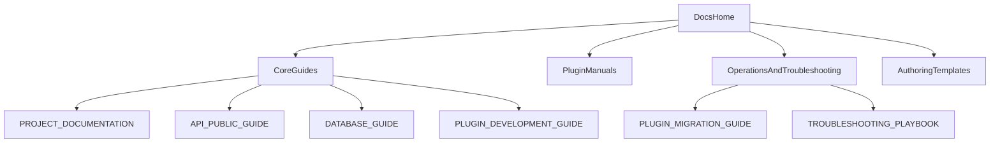

# PMMPCore Docs

Language: **English** | [Español](README.es.md)

Official PMMPCore documentation index and navigation entrypoint.

## Documentation map

## Documents

- `PROJECT_DOCUMENTATION.md` - architecture, runtime, persistence and technical roadmap.
- `DATABASE_GUIDE.md` - **Database layer**: `DatabaseManager`, `PMMPDataProvider`, `RelationalEngine`, WAL, SQL subset, limits, and operational practices (see also `DATABASE_GUIDE.es.md`).
- `API_PUBLIC_GUIDE.md` - public API surface, lifecycle, stability levels, and plugin entrypoints.
- `PLUGIN_MIGRATION_GUIDE.md` - migration notes for legacy plugins moving to PMMPCore API v1.
- `PLUGIN_DEVELOPMENT_GUIDE.md` - complete guide for creating compatible plugins.
- `TROUBLESHOOTING_PLAYBOOK.md` - symptom-based debugging playbook for lifecycle, DB, commands, permissions, and migrations.
- `PLUGIN_DOC_TEMPLATE.md` - official template/checklist for documenting new plugins.
- `plugins/MULTIWORLD_DOCUMENTATION.md` - MultiWorld usage, commands, persistence, and configuration.
- `plugins/PUREPERMS_DOCUMENTATION.md` - PurePerms usage, groups/permissions, persistence, and configuration.
- `plugins/PURECHAT_DOCUMENTATION.md` - PureChat usage, templates/placeholders, permissions, and compatibility commands.
- `plugins/PLACEHOLDERAPI_DOCUMENTATION.md` - PlaceholderAPI usage, built-in expansions, commands, and plugin integration.
- `plugins/ECONOMYAPI_DOCUMENTATION.md` - EconomyAPI usage, wallet/debt/bank operations, commands, events, and integration API.

## Current Coverage

Documented in detail:

- PMMPCore Core.
- Database layer (KV, relational SQL-lite, WAL).
- Public API and migration guidance.
- Plugin development.
- MultiWorld.
- PurePerms.
- PureChat.
- PlaceholderAPI.
- EconomyAPI.

Pending (upcoming versions):

- None. Expand existing docs as APIs evolve.

## How to use this index

If you are:

- **New to PMMPCore** -> start with `PROJECT_DOCUMENTATION.md` then `PLUGIN_DEVELOPMENT_GUIDE.md`.
- **Building plugins** -> read `API_PUBLIC_GUIDE.md`, then `DATABASE_GUIDE.md`, then plugin manuals.
- **Debugging production behavior** -> go directly to `TROUBLESHOOTING_PLAYBOOK.md`.
