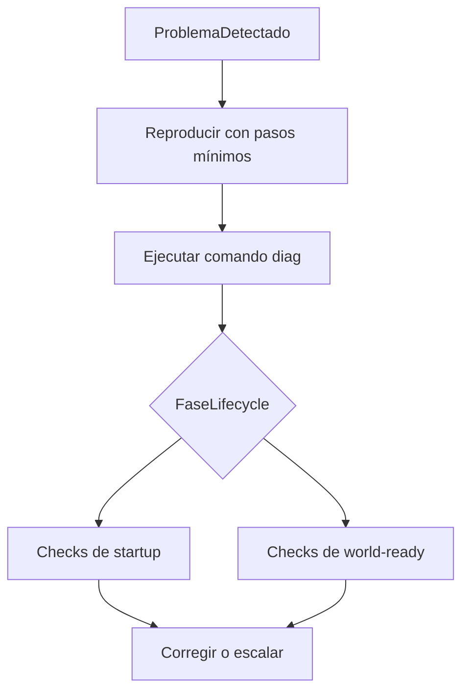

# Playbook de Troubleshooting PMMPCore

Idioma: **Español** | [English](TROUBLESHOOTING_PLAYBOOK.md)

Este playbook está orientado por síntomas. Empieza por lo que ves en logs/comportamiento y sigue la ruta correspondiente.

---

## Inicio rápido de diagnóstico

Secuencia mínima antes de depurar en profundidad:

1. Reproduce el fallo con pasos exactos.
2. Ejecuta `/pmmpcore:diag`.
3. Identifica la fase lifecycle implicada.
4. Revisa permisos y registro de comandos.
5. Revisa flush y estado de migraciones.



---

## Síntoma: `cannot be used in early execution`

### Causa probable

El plugin accede DB/Dynamic Properties demasiado temprano (`onStartup` o fase de startup).

### Cómo confirmarlo

- Revisa hooks del plugin.
- Busca `PMMPCore.db` o `world.getDynamicProperty` en rutas de startup.

### Solución

- Mueve la primera lectura/escritura DB a `onWorldReady()`.
- Deja `onStartup(event)` solo para registro de comandos/enums.

---

## Síntoma: plugin habilitado pero comportamiento roto

### Causa probable

- Estado `enabled` correcto pero falló hidratación en `onWorldReady`.

### Cómo confirmarlo

- Ejecuta `/pmmpcore:pluginstatus <PluginName>`.
- Revisa logs alrededor del hook world-ready del plugin.

### Solución

- Añade logging explícito con try/catch en `onWorldReady`.
- Verifica orden de migraciones y dependencias requeridas.

---

## Síntoma: Los datos “desaparecen” al reiniciar

### Causa probable

Quedaron escrituras en buffer dirty sin `flush()` antes del cierre.

### Cómo confirmarlo

- Revisa si falta `PMMPCore.db.flush()` en rutas críticas.
- Usa `/diag` para revisar comportamiento de flush.

### Solución

- Añade flush explícito tras mutaciones/batches críticos.
- Mantén auto-flush, pero no dependas de él para operaciones que deben sobrevivir sí o sí.

---

## Síntoma: El comando existe pero falla sin detalle

### Causa probable

- Nombre de comando sin `namespace:value`.
- Mismatch entre enum/parámetros y callback.
- Validación de origen fallando.

### Cómo confirmarlo

- Revisa registro en `onStartup(event)`.
- Verifica `mandatoryParameters` y `optionalParameters`.

### Solución

- En docs usa alias root (`/sql`, `/diag`, etc.); las variantes namespaced pueden seguir existiendo a nivel de registro.
- Alinea schema de comando con firma de callback.
- Devuelve `Failure` con mensaje accionable.

---

## Síntoma: Permisos inconsistentes

### Causa probable

- Mezcla de checks backend-specific y checks del contrato estable.
- Nodos con naming inconsistente.

### Cómo confirmarlo

- Audita guards de comandos.
- Compara strings de nodos por acción.

### Solución

- Estandariza en `PMMPCore.getPermissionService()`.
- Usa nodos con prefijo del plugin.
- Crea helper único de guard de permisos.

---

## Síntoma: La migración corre siempre

### Causa probable

- La versión de migración no persiste/avanza correctamente.
- Lógica de migración no idempotente.

### Cómo confirmarlo

- Reinicia mundo y revisa logs de “applied migration” repetida en la misma versión.

### Solución

- Asegura persistencia y avance de versión.
- Haz migraciones idempotentes y aditivas.

---

## Síntoma: Lag de ticks o riesgo watchdog

### Causa probable

- Loops/escrituras síncronas pesadas en un solo tick.
- Scans completos muy frecuentes.

### Cómo confirmarlo

- Inspecciona loops pesados en handlers de comandos/eventos.
- Revisa patrón de scheduler/tareas.

### Solución

- Divide trabajo pesado en varios ticks.
- Usa `PMMPCore.getScheduler()` cuando aplique.
- Reduce frecuencia de escritura y opera por lotes.

---

## Secuencia estándar de diagnóstico

1. Reproducir con pasos mínimos.
2. Revisar `/diag`.
3. Aislar fase de lifecycle (`onStartup` vs `onWorldReady`).
4. Verificar registro de comandos y guards de permisos.
5. Verificar flush/migraciones.
6. Reprobar tras un cambio a la vez.

---

## Árbol de decisión por tipo de síntoma

```mermaid
flowchart TD
  symptom[Sintoma] --> class{Categoria}
  class -->|StartupError| startupChecks[Revisar early execution y startup hooks]
  class -->|CommandIssue| commandChecks[Revisar enum, params y sender validation]
  class -->|PermissionIssue| permChecks[Revisar nodos y contexto world]
  class -->|DataIssue| dataChecks[Revisar flush, migración y ruta storage]
  class -->|PerformanceIssue| perfChecks[Revisar loops, scans y chunking]
```

---

## Síntoma: SQL shell deshabilitado o denegado

### Causa probable

- El toggle global de SQL está en off.
- Faltan permisos SQL (`pmmpcore.sql.read`, `pmmpcore.sql.write`, `pmmpcore.sql.admin`).

### Cómo confirmarlo

- Ejecuta `/sqltoggle on` (solo admin) y reintenta.
- Revisa permisos del jugador/grupo en PurePerms.

### Solución

- Habilita SQL global con `/sqltoggle on`.
- Asigna los nodos SQL requeridos.
- Ejecuta `/sqlseed` una vez y prueba con `/sql SELECT * FROM items`.

---

## Checklist de escalado para maintainers

- Guardar comando exacto de entrada y salida.
- Capturar estado con `pluginstatus`.
- Capturar snapshot de `/diag`.
- Identificar primer hook lifecycle que falla.
- Dejar ruta mínima reproducible en issue/PR.
