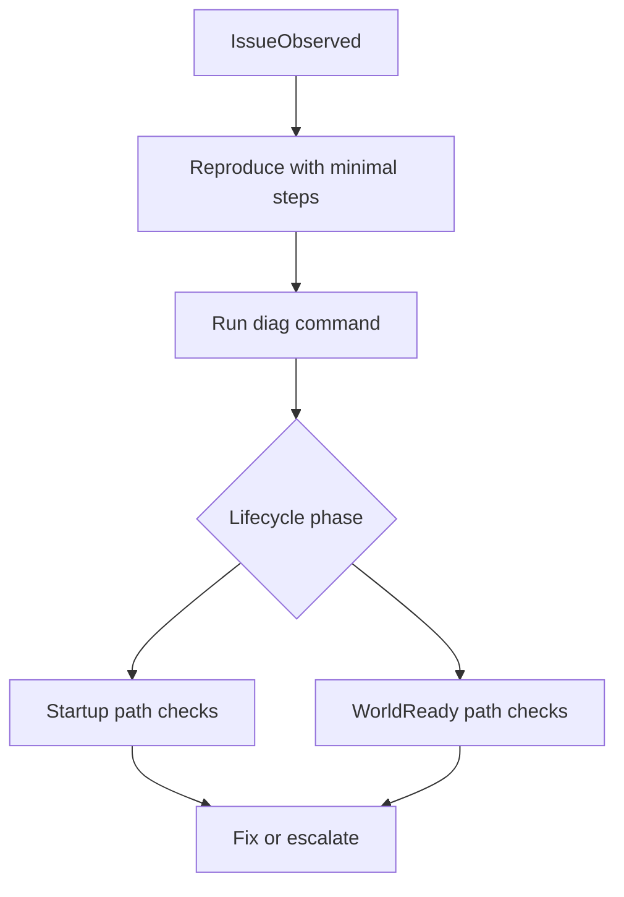

# PMMPCore Troubleshooting Playbook

Language: **English** | [Español](TROUBLESHOOTING_PLAYBOOK.es.md)

This playbook is symptom-driven. Start from what you see in logs/behavior and follow the matching path.

---

## Diagnostic quickstart

Use this minimal sequence before deep debugging:

1. Reproduce once with exact steps.
2. Run `/pmmpcore:diag`.
3. Identify lifecycle phase involved.
4. Check permissions and command registration.
5. Check DB flush and migration state.



---

## Symptom: `cannot be used in early execution`

### Likely cause

Plugin calls DB/world Dynamic Properties too early (`onStartup` or startup phase).

### How to confirm

- Inspect plugin hooks.
- Search for `PMMPCore.db` or `world.getDynamicProperty` in startup paths.

### Fix

- Move first DB read/write to `onWorldReady()`.
- Keep `onStartup(event)` only for command/enum registrations.

---

## Symptom: plugin enabled but not behaving as expected

### Likely cause

- Plugin state is `enabled` but service hydration failed in `onWorldReady`.

### How to confirm

- Run `/pmmpcore:pluginstatus <PluginName>`.
- Check logs around plugin world-ready hook.

### Fix

- Add explicit try/catch logging inside `onWorldReady`.
- Validate migration order and required service dependencies.

---

## Symptom: Data disappears after restart

### Likely cause

Writes remained in dirty buffer and were not flushed before shutdown.

### How to confirm

- Check code path for missing `PMMPCore.db.flush()` after critical writes.
- Use `/diag` to inspect flush behavior.

### Fix

- Add explicit flush after admin-critical mutations/batches.
- Keep auto-flush, but do not rely on it for must-survive operations.

---

## Symptom: Command exists but fails silently

### Likely cause

- Wrong `namespace:value` command name.
- Enum/parameter mismatch.
- Command callback source validation failing.

### How to confirm

- Review `onStartup(event)` command registration.
- Check mandatory/optional parameter definitions.

### Fix

- Prefer root command aliases in docs (`/sql`, `/diag`, etc.); namespaced variants may still exist at registration time.
- Keep command schemas aligned with callback signature.
- Return explicit `Failure` with actionable messages.

---

## Symptom: Permission checks inconsistent

### Likely cause

- Mixed use of backend-specific checks and stable service checks.
- Inconsistent node naming.

### How to confirm

- Audit all command guards.
- Compare node strings used by each action.

### Fix

- Standardize on `PMMPCore.getPermissionService()`.
- Use plugin-prefixed permission nodes.
- Create one reusable permission-guard helper.

---

## Symptom: Migration runs repeatedly

### Likely cause

- Migration version not being persisted correctly.
- Non-idempotent migration logic.

### How to confirm

- Restart world and inspect logs for repeated “applied migration” at same version.

### Fix

- Ensure migration version is stored and advanced.
- Make migration steps idempotent and additive.

---

## Symptom: Tick lag or watchdog risk

### Likely cause

- Heavy synchronous loops/writes in a single tick.
- Full scans performed too often.

### How to confirm

- Inspect heavy loops in command/event handlers.
- Check scheduler/task patterns.

### Fix

- Split heavy work across ticks.
- Use `PMMPCore.getScheduler()` where appropriate.
- Reduce write frequency and batch operations.

---

## Standard diagnostic sequence

1. Reproduce with minimal steps.
2. Check `/diag`.
3. Isolate lifecycle phase (`onStartup` vs `onWorldReady`).
4. Verify command registration and permission guards.
5. Verify flush/migration behavior.
6. Retest after one change at a time.

---

## Decision tree by symptom class

```mermaid
flowchart TD
  symptom[Symptom] --> class{Class}
  class -->|StartupError| startupChecks[Check early execution and startup hooks]
  class -->|CommandIssue| commandChecks[Check enum, params, sender validation]
  class -->|PermissionIssue| permChecks[Check nodes and world context]
  class -->|DataIssue| dataChecks[Check flush, migration, storage path]
  class -->|PerformanceIssue| perfChecks[Check loops, scans, chunking]
```

---

## Symptom: SQL shell is disabled or denied

### Likely cause

- Global SQL toggle is off.
- Missing SQL permission node (`pmmpcore.sql.read`, `pmmpcore.sql.write`, `pmmpcore.sql.admin`).

### How to confirm

- Run `/sqltoggle on` (admin only) and retry.
- Check permissions in PurePerms for the player/group.

### Fix

- Enable SQL shell globally with `/sqltoggle on`.
- Grant required SQL nodes.
- Use `/sqlseed` once, then test with `/sql SELECT * FROM items`.

---

## Escalation checklist for maintainers

- Collect exact command input and output.
- Capture plugin state via `pluginstatus`.
- Capture `/diag` output snapshot.
- Identify first failing lifecycle hook.
- Provide minimal reproducible path in issue/PR comment.
