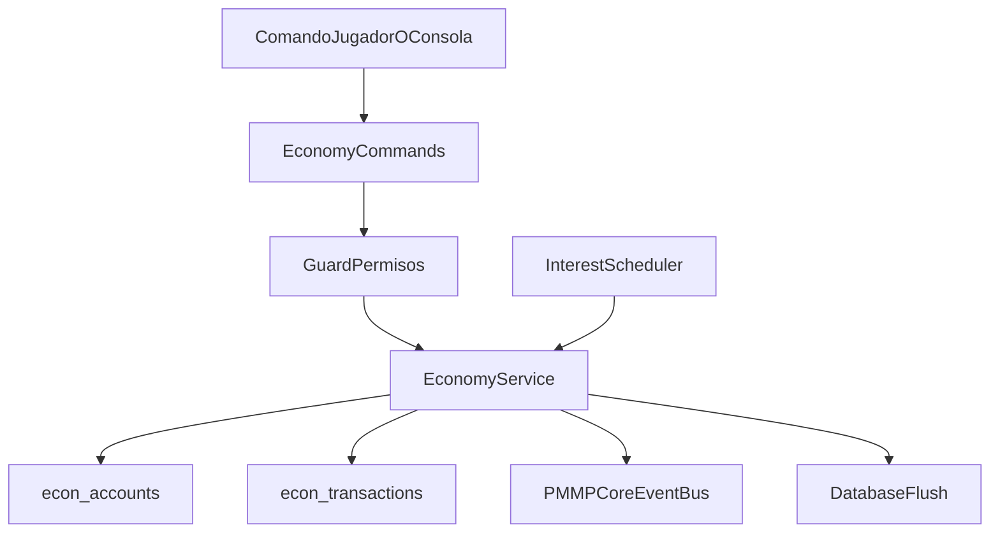
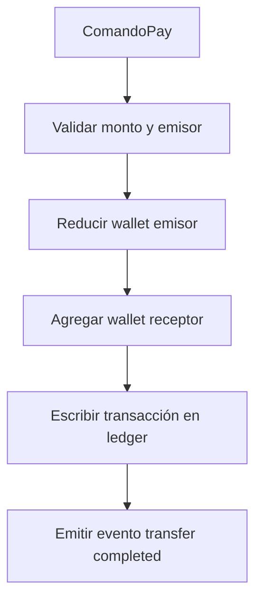
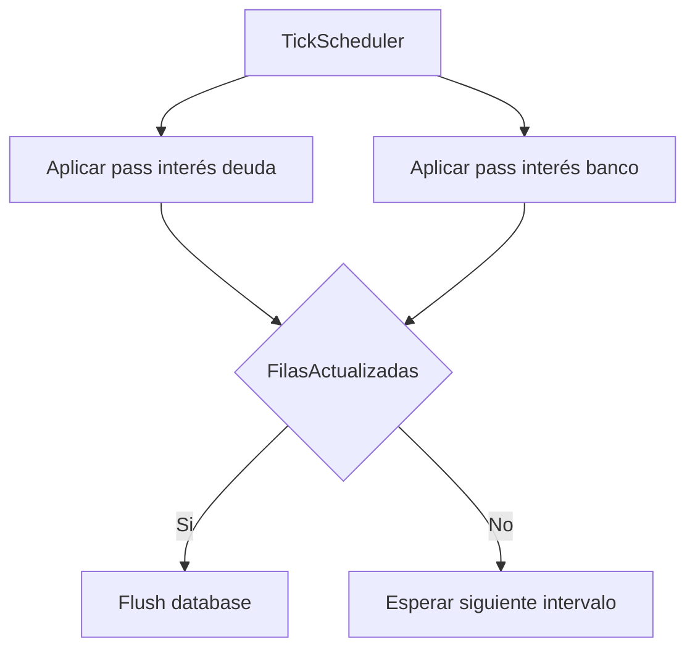

# PMMPCore - Documentacion de EconomyAPI

Idioma: [English](ECONOMYAPI_DOCUMENTATION.md) | **Espanol**

## 1. Proposito

EconomyAPI es el plugin de economia completo para PMMPCore.  
Incluye wallet, deuda, banco, ranking, comandos admin y API para otros plugins.

Nota de arquitectura:

- EconomyAPI es un plugin que expone runtime.
- No forma parte de los exports core de PMMPCore.

## 1.1 Flujo de arquitectura



## 2. Funcionalidades

- Wallet por jugador.
- Sistema de deuda con limites por operacion y limite total.
- Subcuenta bancaria (deposit/withdraw/admin bank).
- Ranking top money paginado.
- Jobs periodicos de interes para deuda y banco.
- Emision de eventos de cambios economicos.

## 2.1 Lifecycle

- `onEnable`: registra migracion y facade runtime.
- `onStartup`: registra todos los comandos Bedrock.
- `onWorldReady`: ejecuta migracion, inicializa storage/servicio, inicia schedulers de interes y emite `economy.ready`.
- `onDisable`: detiene intervalos y hace flush de datos pendientes.

## 3. Comandos

Comandos de usuario:

- `/mymoney`
- `/mydebt`
- `/takedebt <money>`
- `/returndebt <money>`
- `/topmoney [page]`
- `/seemoney <player>`
- `/mystatus`
- `/pay <player> <money>`
- `/economys`
- `/bank deposit <money>`
- `/bank withdraw <money>`
- `/bank mymoney`

Comandos admin:

- `/setmoney <player> <money>`
- `/givemoney <player> <money>`
- `/takemoney <player> <money>`
- `/bankadmin givemoney <player> <money>`
- `/bankadmin takemoney <player> <money>`
- `/moneysave`
- `/moneyload`

## 4. Permisos

- `economy.command.mymoney`
- `economy.command.mydebt`
- `economy.command.takedebt`
- `economy.command.returndebt`
- `economy.command.topmoney`
- `economy.command.seemoney`
- `economy.command.mystatus`
- `economy.command.pay`
- `economy.command.bank`
- `economy.command.economys`
- `economy.admin.setmoney`
- `economy.admin.givemoney`
- `economy.admin.takemoney`
- `economy.admin.bank`
- `economy.admin.save`
- `economy.admin.load`

## 5. Modelo de datos

EconomyAPI usa PMMPCore DB + `RelationalEngine`:

- `econ_accounts`: `player`, `wallet`, `debt`, `bank`, `updatedAt`
- `econ_transactions`: `txId`, `type`, `from`, `to`, `amount`, `createdAt`, `meta`

La configuracion KV vive en `plugin:EconomyAPI`.

## 5.1 Estrategia de persistencia

- **Tablas relacionales** para cuentas e historial de transacciones (ranking y auditoria indexada).
- **KV plugin data** para config runtime, metadatos de schema y registro de plugins consumidores.
- **Politica de flush**:
  - flush inmediato en comandos admin `moneysave/moneyload`,
  - flush tras lotes de intereses,
  - flush defensivo al apagar plugin.

## 6. Reglas de negocio

- No se permiten montos negativos ni NaN.
- Para retirar/pagar wallet debe tener fondos suficientes.
- Deuda:
  - limitada por `onceDebtLimit`
  - limitada por `debtLimit`
- `returndebt` no permite sobrepago por debajo de cero.
- Ranking respeta `addOpAtRank`:
  - `false`: excluye grupo OP del top
  - `true`: incluye grupo OP

## 6.1 Semantica de transaccion

- Cada cambio de wallet/deuda/banco crea registro en `econ_transactions`.
- `payMoney(from, to, amount)` ejecuta:
  1. reduce wallet emisor,
  2. suma wallet receptor,
  3. registra evento/ledger de transferencia.
- Los errores de comandos emiten `economy.transaction.failed`.

## 7. Runtime API para otros plugins

Acceso por registro de plugins de PMMPCore:

```js
import { PMMPCore } from "../../PMMPCore.js";

const economyPlugin = PMMPCore.getPlugin("EconomyAPI");
const economy = economyPlugin?.runtime ?? null;
economy?.registerConsumer("MyShop");
economy?.addMoney("playerName", 100, "MyShop");
```

Metodos disponibles:

- `getMoney`, `setMoney`, `addMoney`, `reduceMoney`, `payMoney`
- `getDebt`, `takeDebt`, `returnDebt`
- `getBankMoney`, `bankDeposit`, `bankWithdraw`
- `getTopMoney`, `getStatus`
- `registerConsumer`, `listConsumers`

## 7.1 Contrato de consumo

- Los plugins consumidores deben registrar su nombre con `registerConsumer("NombrePlugin")`.
- El comando `/economys` muestra ese registro para observabilidad operativa.

## 8. Eventos emitidos

- `economy.ready`
- `economy.account.created`
- `economy.wallet.changed`
- `economy.debt.changed`
- `economy.bank.changed`
- `economy.transfer.completed`
- `economy.transaction.failed`
- `economy.config.reloaded`

## 8.1 Guia de payload de eventos

Payload recomendado:

- actor/plugin fuente
- jugador(es) objetivo
- valores old/new + delta
- tipo de operacion + metadatos

Esto permite integraciones (shops, quests, rewards, auditoria) sin acoplarse al servicio interno.

## 9. Checklist de prueba rapida

```text
/mymoney
/mydebt
/takedebt 50
/returndebt 20
/bank deposit 25
/bank mymoney
/bank withdraw 10
/pay SomePlayer 5
/topmoney 1
/mystatus
/economys
```

Admin:

```text
/setmoney SomePlayer 1000
/givemoney SomePlayer 50
/takemoney SomePlayer 10
/bankadmin givemoney SomePlayer 30
/bankadmin takemoney SomePlayer 5
/moneysave
/moneyload
```

## 10. Troubleshooting

### Comandos devuelven falta de permisos

- Verifica nodos PurePerms del grupo del emisor.
- Confirma si el comando espera jugador o consola.

### Deuda rechaza montos que parecen validos

- Revisa `onceDebtLimit` y `debtLimit`.
- Valida estado con `/mystatus`.

### El top no muestra usuarios OP

- Es esperado si `addOpAtRank = false`.
- Activa el flag en config de plugin y recarga/reinicia.

### No ves aplicarse intereses

- Verifica que el mundo estuvo cargado el tiempo suficiente para los intervalos.
- Ejecuta `/moneysave` y vuelve a consultar balances.

## 11. Flujos Mermaid adicionales

### 11.1 Flujo de transacción de transferencia wallet



### 11.2 Flujo de scheduler de intereses


