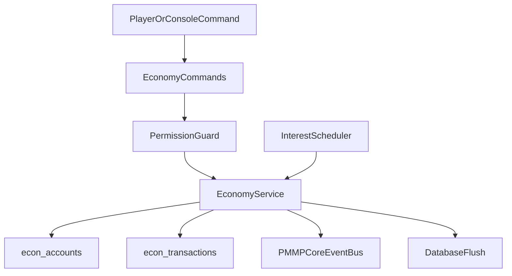
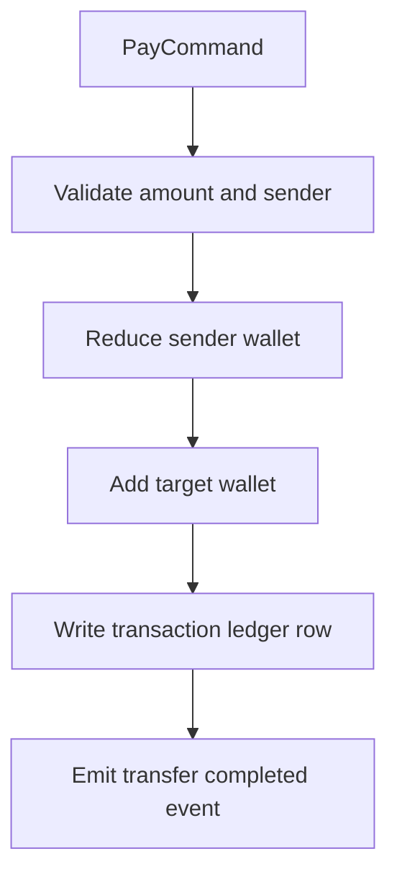
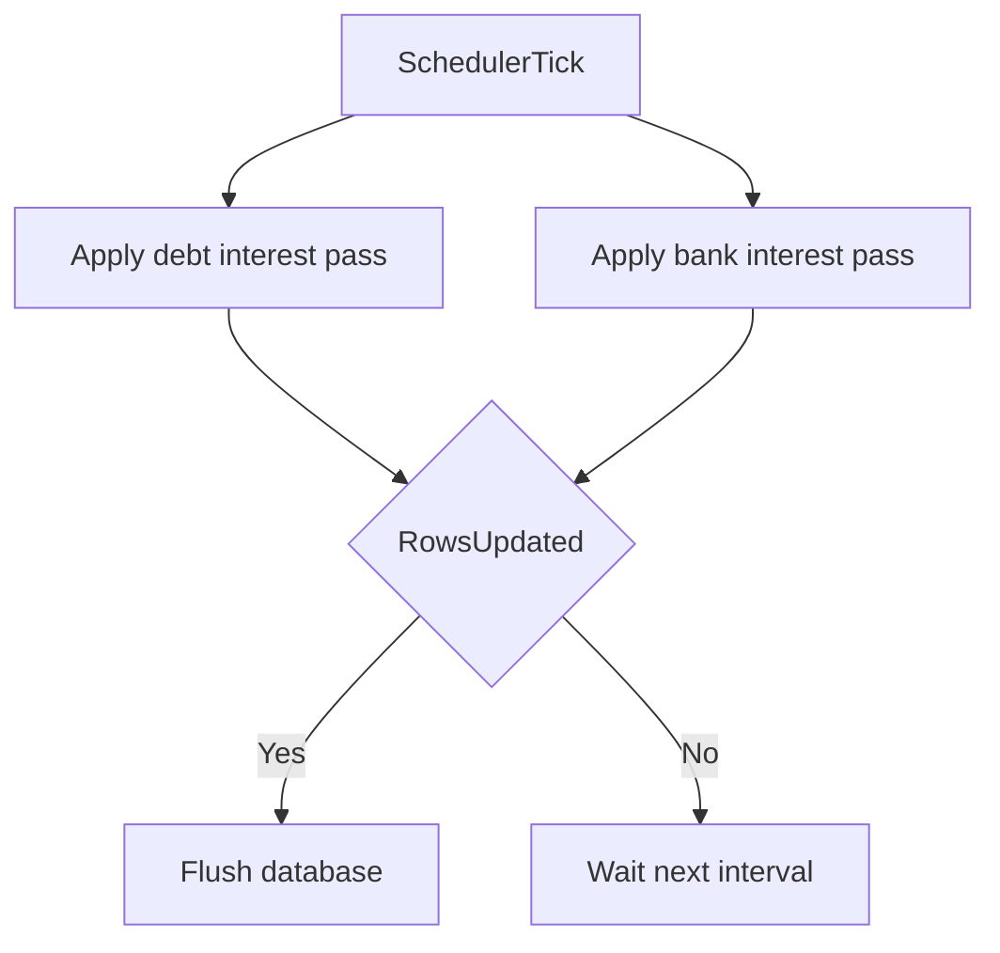

# PMMPCore - EconomyAPI Documentation

Language: **English** | [Español](ECONOMYAPI_DOCUMENTATION.es.md)

## 1. Purpose

EconomyAPI is the full economy plugin for PMMPCore.  
It provides wallet, debt, bank, ranking, admin commands, and integration APIs for other plugins.

Architecture note:

- EconomyAPI is a plugin that exposes runtime methods.
- It is not exported through PMMPCore core API surface.

## 1.1 Architecture Flow



## 2. Features

- Wallet accounts per player.
- Debt system with per-borrow and global limits.
- Bank sub-account (deposit/withdraw/admin bank operations).
- Top money ranking with pagination.
- Periodic debt/bank interest jobs.
- Event emission for account and money changes.

## 2.1 Lifecycle

- `onEnable`: registers migration and runtime facade.
- `onStartup`: registers all Bedrock commands.
- `onWorldReady`: runs migration, initializes storage/services, starts interest schedulers, emits `economy.ready`.
- `onDisable`: stops intervals and flushes pending DB data.

## 3. Commands

User commands:

- `/mymoney`
- `/mydebt`
- `/takedebt <money>`
- `/returndebt <money>`
- `/topmoney [page]`
- `/seemoney <player>`
- `/mystatus`
- `/pay <player> <money>`
- `/economys`
- `/bank deposit <money>`
- `/bank withdraw <money>`
- `/bank mymoney`

Admin commands:

- `/setmoney <player> <money>`
- `/givemoney <player> <money>`
- `/takemoney <player> <money>`
- `/bankadmin givemoney <player> <money>`
- `/bankadmin takemoney <player> <money>`
- `/moneysave`
- `/moneyload`

## 4. Permissions

- `economy.command.mymoney`
- `economy.command.mydebt`
- `economy.command.takedebt`
- `economy.command.returndebt`
- `economy.command.topmoney`
- `economy.command.seemoney`
- `economy.command.mystatus`
- `economy.command.pay`
- `economy.command.bank`
- `economy.command.economys`
- `economy.admin.setmoney`
- `economy.admin.givemoney`
- `economy.admin.takemoney`
- `economy.admin.bank`
- `economy.admin.save`
- `economy.admin.load`

## 5. Data Model

EconomyAPI stores data using PMMPCore DB and `RelationalEngine`:

- `econ_accounts`: `player`, `wallet`, `debt`, `bank`, `updatedAt`
- `econ_transactions`: `txId`, `type`, `from`, `to`, `amount`, `createdAt`, `meta`

Plugin KV config lives in `plugin:EconomyAPI`.

## 5.1 Storage Strategy

- **Relational tables** are used for accounts and transaction history because ranking and audit queries require indexed retrieval.
- **KV plugin data** stores runtime config, schema metadata, and consumer plugin registry.
- **Flush policy**:
  - immediate flush for admin save/load commands,
  - periodic flush after scheduled interest updates,
  - defensive flush on plugin disable.

## 6. Business Rules

- No negative amounts or invalid numeric values.
- Wallet reduce/pay requires sufficient money.
- Debt borrow:
  - bounded by `onceDebtLimit`
  - bounded by `debtLimit`
- Debt return cannot over-return below zero.
- Ranking respects `addOpAtRank` flag:
  - `false`: excludes OP group from top list
  - `true`: includes OP group

## 6.1 Transaction Semantics

- Every balance/debt/bank mutation creates a ledger record in `econ_transactions`.
- `payMoney(from, to, amount)` executes as:
  1. reduce sender wallet,
  2. add receiver wallet,
  3. record transfer event + transaction row.
- Errors in command handlers emit `economy.transaction.failed`.

## 7. Runtime API for Other Plugins

Use PMMPCore plugin registry:

```js
import { PMMPCore } from "../../PMMPCore.js";

const economyPlugin = PMMPCore.getPlugin("EconomyAPI");
const economy = economyPlugin?.runtime ?? null;
economy?.registerConsumer("MyShop");
economy?.addMoney("playerName", 100, "MyShop");
```

Available runtime methods include:

- `getMoney`, `setMoney`, `addMoney`, `reduceMoney`, `payMoney`
- `getDebt`, `takeDebt`, `returnDebt`
- `getBankMoney`, `bankDeposit`, `bankWithdraw`
- `getTopMoney`, `getStatus`
- `registerConsumer`, `listConsumers`

## 7.1 Consumer Registration Contract

- Plugins that use EconomyAPI should call `registerConsumer("PluginName")` during their enable/startup phase.
- `/economys` command reads this registry for operational visibility.

## 8. Emitted Events

- `economy.ready`
- `economy.account.created`
- `economy.wallet.changed`
- `economy.debt.changed`
- `economy.bank.changed`
- `economy.transfer.completed`
- `economy.transaction.failed`
- `economy.config.reloaded`

## 8.1 Event Payload Guidelines

Typical payloads include:

- actor/source plugin
- target player(s)
- old/new values and delta
- operation type and optional metadata

This allows downstream plugins (shops, quests, rewards, anti-fraud logs) to react without direct coupling.

## 9. Quick Test Checklist

```text
/mymoney
/mydebt
/takedebt 50
/returndebt 20
/bank deposit 25
/bank mymoney
/bank withdraw 10
/pay SomePlayer 5
/topmoney 1
/mystatus
/economys
```

Admin:

```text
/setmoney SomePlayer 1000
/givemoney SomePlayer 50
/takemoney SomePlayer 10
/bankadmin givemoney SomePlayer 30
/bankadmin takemoney SomePlayer 5
/moneysave
/moneyload
```

## 10. Troubleshooting

### Commands return missing permission

- Verify PurePerms nodes for the sender group.
- Ensure command was executed as player vs console according to command semantics.

### Debt command rejects valid-looking values

- Check `onceDebtLimit` and `debtLimit` current config values.
- Verify wallet/debt state with `/mystatus`.

### Top ranking does not show OP users

- Intended if `addOpAtRank` is `false`.
- Enable the flag in plugin config data and reload/restart.

### Interest seems not applied

- Confirm world stayed loaded long enough for scheduler interval.
- Run `/moneysave` and re-check balances.

## 11. Additional Mermaid Flows

### 11.1 Wallet transfer transaction flow



### 11.2 Interest scheduler flow


