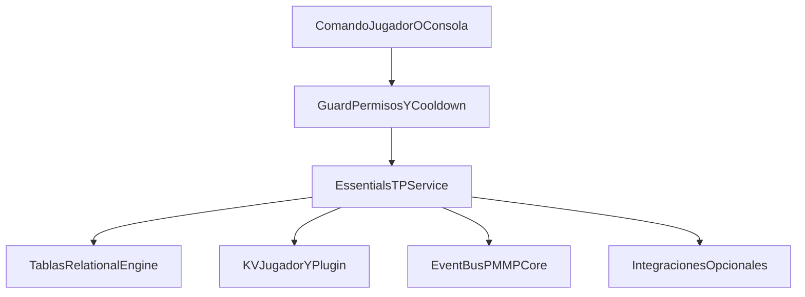
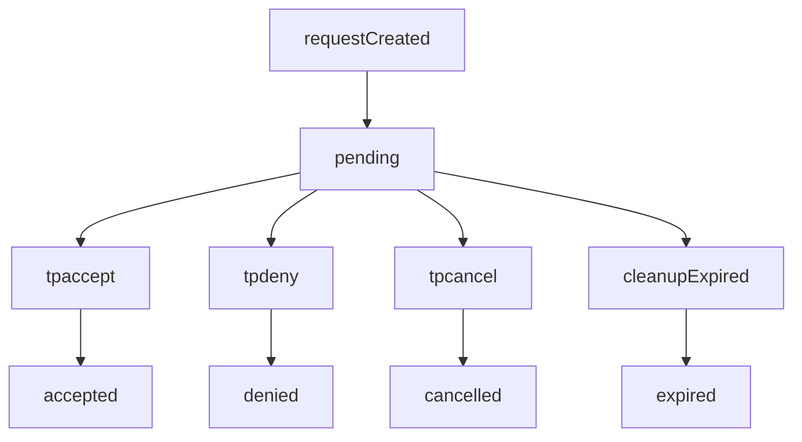
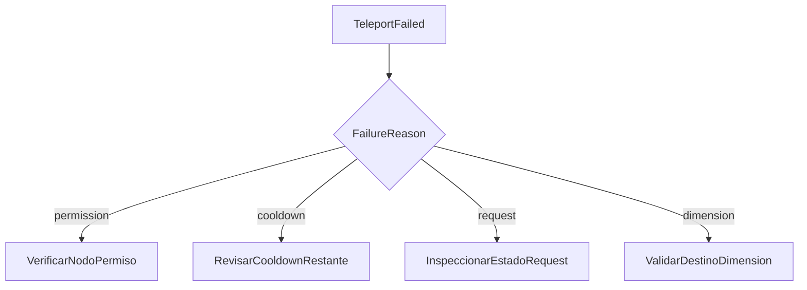

# PMMPCore - Documentacion de EssentialsTP

Idioma: [English](ESSENTIALSTP_DOCUMENTATION.md) | **Espanol**

## 1. Proposito

EssentialsTP es el plugin de utilidades de teletransporte para PMMPCore.
Incluye homes, warps, spawn, back, teletransporte random (`wild`) y solicitudes entre jugadores.

## 1.1 Arquitectura



## 2. Lifecycle

- `onEnable`: crea servicio/runtime y registra metadata de migracion.
- `onStartup`: registra comandos Bedrock (`pmmpcore:*` y alias).
- `onWorldReady`: inicializa persistencia relacional/KV, inicia limpieza de requests expiradas, registra expansion PlaceholderAPI si existe, emite `essentialstp.ready`.
- `onDisable`: limpia intervalos y hace flush de DB.

## 3. Comandos

Comandos de jugador:

- `/sethome [name]`
- `/home [name]`
- `/delhome [name]`
- `/back`
- `/spawn`
- `/wild`
- `/warp <name>`
- `/tpa <player>`
- `/tpahere <player>`
- `/tpaccept [player]`
- `/tpdeny [player]`
- `/tpcancel [player]`

Comandos administrativos:

- `/setspawn`
- `/setwarp <name>`
- `/delwarp <name>`

## 3.1 Guia paso a paso (uso en juego)

### Antes de empezar

1. Activa el behavior pack que carga PMMPCore y el loader de plugins (incluye `EssentialsTP`).
2. **Permisos:** cada comando usa un nodo `essentialstp.command.*` o `essentialstp.admin.*` (ver seccion 4). Con **PurePerms**, si eres operador de Bedrock sueles tener acceso total salvo que en la config de PurePerms este desactivado el bypass de OP (`disableOp`).
3. **Sintaxis recomendada:** usa siempre el namespace `pmmpcore:` (por ejemplo `/pmmpcore:home`). El plugin tambien registra **alias** sin prefijo (`/home`, `/sethome`, etc.); si un alias no aparece en tu cliente, usa la forma `pmmpcore:`.
4. **Teletransporte:** el movimiento real puede ocurrir **un instante despues** de enviar el comando (el TP se aplaza al siguiente tick para cumplir las reglas de Bedrock sobre comandos personalizados).

### Homes (casa)

| Paso | Accion | Comando |
|------|--------|---------|
| 1 | Parate donde quieras guardar el home | — |
| 2 | Guardar home por defecto (`home`) | `/pmmpcore:sethome` o `/sethome` |
| 3 | Ir a ese home | `/pmmpcore:home` o `/home` |
| 4 | Guardar otro home con nombre | `/pmmpcore:sethome mina` |
| 5 | Ir a ese home | `/pmmpcore:home mina` |
| 6 | Borrar un home | `/pmmpcore:delhome mina` |

Por defecto: hasta **5** homes por jugador; nombre maximo **24** caracteres (se normaliza a minusculas).

### Back (volver atras)

1. Usa cualquier teletransporte del plugin (home, warp, spawn, wild, tpa aceptado, etc.).
2. Ejecuta `/pmmpcore:back` (o `/back`) para volver a la posicion guardada como `back`.

Hay **cooldown** entre usos (por defecto **5 s** para `back`; configurable en `cooldowns.backSeconds`).

### Spawn

**Quien configura** (permiso `essentialstp.command.setspawn`):

1. Ir al punto deseado en la **dimension** donde aplica ese spawn.
2. `/pmmpcore:setspawn` (o `/setspawn`).

**Quien usa** (permiso `essentialstp.command.spawn`):

1. `/pmmpcore:spawn` (o `/spawn`): intenta el spawn de tu **dimension actual**; si no existe, puede usar el de overworld si esta guardado.

Si no hay spawn configurado, el comando indicara que falta definirlo.

### Warps (globales)

| Paso | Quien | Comando |
|------|--------|---------|
| 1 | Admin en el sitio (`essentialstp.admin.setwarp`) | `/pmmpcore:setwarp nombre` |
| 2 | Jugador (`essentialstp.command.warp`) | `/pmmpcore:warp nombre` |
| 3 | Admin borrar (`essentialstp.admin.delwarp`) | `/pmmpcore:delwarp nombre` |

### Wild (aleatorio)

1. En la dimension donde quieras explorar: `/pmmpcore:wild` (o `/wild`).
2. Si falla tras varios intentos, el mundo no encontro un punto seguro; reintenta o ajusta `wild` en la config del plugin.

### TPA y TPAHERE (dos jugadores online)

Sustituye `OtroJugador` por el nombre real. Las solicitudes **expiran** (por defecto **30 s**, `requests.timeoutSeconds`).

**Quiero ir yo hacia el (`tpa`):**

1. Solicitante: `/pmmpcore:tpa OtroJugador`
2. Receptor: `/pmmpcore:tpaccept` o `/pmmpcore:tpaccept NombreSolicitante` si hay varias pendientes
3. Rechazar: `/pmmpcore:tpdeny` o `/pmmpcore:tpdeny NombreSolicitante`
4. El solicitante puede cancelar: `/pmmpcore:tpcancel` o `/pmmpcore:tpcancel OtroJugador`

**Quiero que el otro venga a mi (`tpahere`):**

1. Tu: `/pmmpcore:tpahere OtroJugador`
2. El otro: `/pmmpcore:tpaccept` (o con tu nombre si hace falta)

Hay **cooldown** en `tpa` y `tpahere` (por defecto **5 s** cada uno).

### Costes (EconomyAPI)

Si en los datos del plugin `costs.enabled` es `true` y hay montos configurados, algunos comandos pueden cobrar via EconomyAPI cuando ese plugin esta disponible. Con los valores por defecto del codigo fuente, **no se cobra**.

## 4. Nodos de permiso

- `essentialstp.command.home`
- `essentialstp.command.sethome`
- `essentialstp.command.delhome`
- `essentialstp.command.back`
- `essentialstp.command.wild`
- `essentialstp.command.spawn`
- `essentialstp.command.warp`
- `essentialstp.command.tpa`
- `essentialstp.command.tpahere`
- `essentialstp.command.tpaccept`
- `essentialstp.command.tpdeny`
- `essentialstp.command.tpcancel`
- `essentialstp.command.setspawn`
- `essentialstp.admin.setwarp`
- `essentialstp.admin.delwarp`

## 5. Modelo de datos

Tablas relacionales:

- `ess_tp_homes`: owner/name + posicion y rotacion.
- `ess_tp_requests`: requester/target/type/state con timestamps de expiracion.
- `ess_tp_warps`: destinos globales por nombre.
- `ess_tp_spawns`: spawn override por dimension.

KV:

- `player:<name>.essentialsTP.back`
- `player:<name>.essentialsTP.cooldowns`
- `plugin:EssentialsTP` (`meta`, `config`)

## 5.1 Ciclo de vida de requests



## 6. Reglas de negocio

- Bloquea self-request y jugadores offline.
- Las requests expiran por timeout (`requests.timeoutSeconds`) y limpieza periodica.
- Cooldowns por accion guardados por jugador.
- Nombres de home/warp validados por longitud maxima y normalizados a lowercase.
- Cada teletransporte guarda una ubicacion de `back` previa.
- `/tpaccept [player]`, `/tpdeny [player]` y `/tpcancel [player]` soportan seleccion por jugador.

## 7. Integraciones opcionales

- **PlaceholderAPI**: registra expansion `essentialstp`.
  - `%essentialstp_home_count%`
  - `%essentialstp_pending_requests%`
  - `%essentialstp_back_available%`
  - `%essentialstp_cooldown_home%`
- **EconomyAPI**: costos opcionales por accion si `costs.enabled` esta activo.
- **MultiWorld**: sin dependencia dura; teleports cross-dimension degradan de forma segura.

## 8. Eventos emitidos

- `essentialstp.ready`
- `essentialstp.request.created`
- `essentialstp.request.accepted`
- `essentialstp.request.denied`
- `essentialstp.request.expired`
- `essentialstp.teleport.performed`
- `essentialstp.teleport.failed`
- `essentialstp.home.set`
- `essentialstp.home.deleted`
- `essentialstp.back.updated`
- `essentialstp.cooldown.blocked`

## 9. Checklist de prueba rapida

Para la guia detallada ordenada por flujo, ver **seccion 3.1**.

```text
/sethome
/home
/sethome mine
/home mine
/delhome mine
/setwarp market
/warp market
/setspawn
/spawn
/wild
/tpa <player>
/tpaccept
/tpdeny
/tpcancel
/back
```

## 10. Troubleshooting

### No aparece request en `tpaccept`/`tpdeny`

- Puede haber expirado; sube `requests.timeoutSeconds`.
- Usa argumento opcional de jugador para seleccionar la request correcta.

### Teleport falla por dimension no disponible

- El destino no es valido/cargable en el runtime Bedrock.
- Revalida registro del mundo o destino y reintenta.

### `Native function [Entity::teleport] cannot be used in restricted execution`

- Bedrock ejecuta los callbacks de comandos personalizados en un contexto restringido; llamar `player.teleport()` ahi lanza este error.
- EssentialsTP aplaza el teletransporte al siguiente tick con `system.run()` para ejecutarlo fuera de ese contexto. Si sigues viendo el mensaje, confirma que el behavior pack incluye ese cambio.

### Cooldown bloquea comando inesperadamente

- Revisa snapshot de cooldowns por runtime API.
- Verifica valores `cooldowns.*Seconds` en config del plugin.

## 10.1 Flujo de troubleshooting


