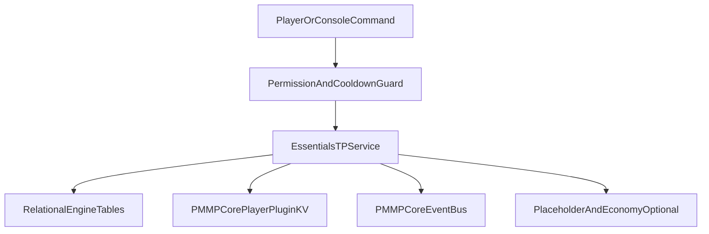
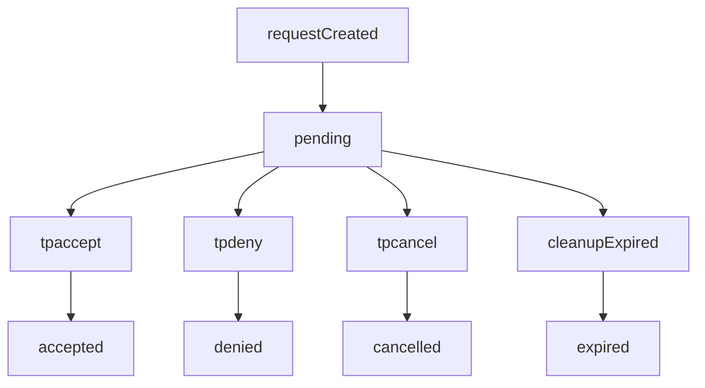
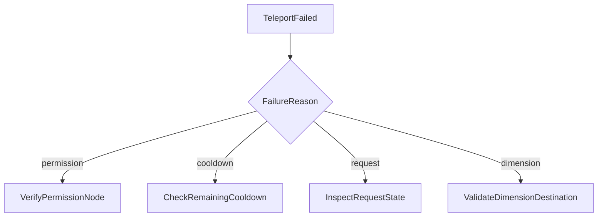

# PMMPCore - EssentialsTP Documentation

Language: **English** | [Español](ESSENTIALSTP_DOCUMENTATION.es.md)

## 1. Purpose

EssentialsTP is the teleport utility plugin for PMMPCore.
It provides homes, warps, spawn, back, random wild teleports, and player-to-player request teleports.

## 1.1 Architecture



## 2. Lifecycle

- `onEnable`: create service/runtime facade and register schema migration metadata.
- `onStartup`: register all Bedrock commands (`pmmpcore:*` + aliases).
- `onWorldReady`: initialize relational/KV persistence, start request cleanup interval, register PlaceholderAPI expansion if available, emit `essentialstp.ready`.
- `onDisable`: clear intervals and flush DB.

## 3. Commands

Player commands:

- `/sethome [name]`
- `/home [name]`
- `/delhome [name]`
- `/back`
- `/spawn`
- `/wild`
- `/warp <name>`
- `/tpa <player>`
- `/tpahere <player>`
- `/tpaccept [player]`
- `/tpdeny [player]`
- `/tpcancel [player]`

Administrative commands:

- `/setspawn`
- `/setwarp <name>`
- `/delwarp <name>`

## 3.1 Step-by-step usage guide

### Before you start

1. Enable the behavior pack that loads PMMPCore and the plugin loader (including `EssentialsTP`).
2. **Permissions:** each command maps to an `essentialstp.command.*` or `essentialstp.admin.*` node (see section 4). With **PurePerms**, Bedrock operators usually bypass checks unless PurePerms config disables OP bypass (`disableOp`).
3. **Recommended syntax:** prefer the `pmmpcore:` namespace (for example `/pmmpcore:home`). The plugin also registers **aliases** without the prefix (`/home`, `/sethome`, etc.); if an alias is missing on your client, use the `pmmpcore:` form.
4. **Teleport timing:** the actual move may happen **a moment after** you send the command (teleport is deferred to the next tick to satisfy Bedrock custom-command execution rules).

### Homes

| Step | Action | Command |
|------|--------|---------|
| 1 | Stand where you want the home | — |
| 2 | Save default home name `home` | `/pmmpcore:sethome` or `/sethome` |
| 3 | Go to that home | `/pmmpcore:home` or `/home` |
| 4 | Save a named home | `/pmmpcore:sethome mine` |
| 5 | Go to that home | `/pmmpcore:home mine` |
| 6 | Delete a home | `/pmmpcore:delhome mine` |

Defaults: up to **5** homes per player; name max length **24** (normalized to lowercase).

### Back

1. Use any plugin teleport (home, warp, spawn, wild, accepted tpa, etc.).
2. Run `/pmmpcore:back` (or `/back`) to return to the saved `back` location.

There is a **cooldown** between uses (default **5 s** for `back`; see `cooldowns.backSeconds`).

### Spawn

**Setup** (permission `essentialstp.command.setspawn`):

1. Stand at the desired point in the **dimension** that spawn applies to.
2. `/pmmpcore:setspawn` (or `/setspawn`).

**Use** (permission `essentialstp.command.spawn`):

1. `/pmmpcore:spawn` (or `/spawn`): uses the spawn for your **current** dimension if set; may fall back to overworld spawn if configured.

If no spawn is stored, the command reports that spawn is not configured.

### Warps

| Step | Who | Command |
|------|-----|---------|
| 1 | Admin at location (`essentialstp.admin.setwarp`) | `/pmmpcore:setwarp name` |
| 2 | Player (`essentialstp.command.warp`) | `/pmmpcore:warp name` |
| 3 | Admin delete (`essentialstp.admin.delwarp`) | `/pmmpcore:delwarp name` |

### Wild

1. In the dimension you want: `/pmmpcore:wild` (or `/wild`).
2. If it fails after several attempts, no safe spot was found; retry or tune `wild` in plugin config.

### TPA and TPAHERE (two online players)

Replace `OtherPlayer` with the real name. Requests **expire** (default **30 s**, `requests.timeoutSeconds`).

**I want to go to them (`tpa`):**

1. Requester: `/pmmpcore:tpa OtherPlayer`
2. Target: `/pmmpcore:tpaccept` or `/pmmpcore:tpaccept RequesterName` if multiple are pending
3. Deny: `/pmmpcore:tpdeny` or `/pmmpcore:tpdeny RequesterName`
4. Requester can cancel: `/pmmpcore:tpcancel` or `/pmmpcore:tpcancel OtherPlayer`

**I want them to come to me (`tpahere`):**

1. You: `/pmmpcore:tpahere OtherPlayer`
2. Other player: `/pmmpcore:tpaccept` (or with your name if needed)

Cooldowns apply to `tpa` and `tpahere` (default **5 s** each).

### Economy costs (EconomyAPI)

If plugin data has `costs.enabled` set `true` with non-zero amounts, some commands may charge via EconomyAPI when that plugin is present. With the source defaults, **no charges** apply.

## 4. Permission nodes

- `essentialstp.command.home`
- `essentialstp.command.sethome`
- `essentialstp.command.delhome`
- `essentialstp.command.back`
- `essentialstp.command.wild`
- `essentialstp.command.spawn`
- `essentialstp.command.warp`
- `essentialstp.command.tpa`
- `essentialstp.command.tpahere`
- `essentialstp.command.tpaccept`
- `essentialstp.command.tpdeny`
- `essentialstp.command.tpcancel`
- `essentialstp.command.setspawn`
- `essentialstp.admin.setwarp`
- `essentialstp.admin.delwarp`

## 5. Data model

Relational tables:

- `ess_tp_homes`: owner/name + position and rotation.
- `ess_tp_requests`: requester/target/type/state with expiration timestamps.
- `ess_tp_warps`: global named destinations.
- `ess_tp_spawns`: per-dimension spawn override.

KV data:

- `player:<name>.essentialsTP.back`
- `player:<name>.essentialsTP.cooldowns`
- `plugin:EssentialsTP` (`meta`, `config`)

## 5.1 Request lifecycle



## 6. Behavior and rules

- Rejects self-requests and offline targets.
- Requests expire by timeout (`requests.timeoutSeconds`), with periodic cleanup.
- Cooldowns are action-specific and stored per player.
- Home and warp names are validated by max length and normalized to lowercase.
- Teleports store a `back` location before movement.
- `/tpaccept [player]`, `/tpdeny [player]`, and `/tpcancel [player]` support selective handling by player.

## 7. Optional integrations

- **PlaceholderAPI**: registers `essentialstp` expansion.
  - `%essentialstp_home_count%`
  - `%essentialstp_pending_requests%`
  - `%essentialstp_back_available%`
  - `%essentialstp_cooldown_home%`
- **EconomyAPI**: optional per-action costs if enabled in config (`costs.enabled`).
- **MultiWorld**: no hard dependency; cross-dimension teleport uses native dimension IDs and degrades safely.

## 8. Emitted events

- `essentialstp.ready`
- `essentialstp.request.created`
- `essentialstp.request.accepted`
- `essentialstp.request.denied`
- `essentialstp.request.expired`
- `essentialstp.teleport.performed`
- `essentialstp.teleport.failed`
- `essentialstp.home.set`
- `essentialstp.home.deleted`
- `essentialstp.back.updated`
- `essentialstp.cooldown.blocked`

## 9. Quick test checklist

For the full ordered walkthrough, see **section 3.1**.

```text
/sethome
/home
/sethome mine
/home mine
/delhome mine
/setwarp market
/warp market
/setspawn
/spawn
/wild
/tpa <player>
/tpaccept
/tpdeny
/tpcancel
/back
```

## 10. Troubleshooting

### Request not found on `tpaccept`/`tpdeny`

- Request may already be expired; increase `requests.timeoutSeconds`.
- Use optional player argument to target the exact requester.

### Teleport fails with dimension unavailable

- Destination dimension is not currently valid/loaded in Bedrock runtime.
- Recreate or re-register world destination and retry.

### `Native function [Entity::teleport] cannot be used in restricted execution`

- Bedrock runs custom command callbacks in a restricted context; direct `player.teleport()` there throws this error.
- EssentialsTP defers the actual teleport to the next tick via `system.run()` so it runs outside that context. If you still see this message, ensure you are on the latest pack build that includes that change.

### Cooldown blocks command unexpectedly

- Inspect player cooldown snapshot through runtime API.
- Validate `cooldowns.*Seconds` values in plugin config data.

## 10.1 Troubleshooting flow


