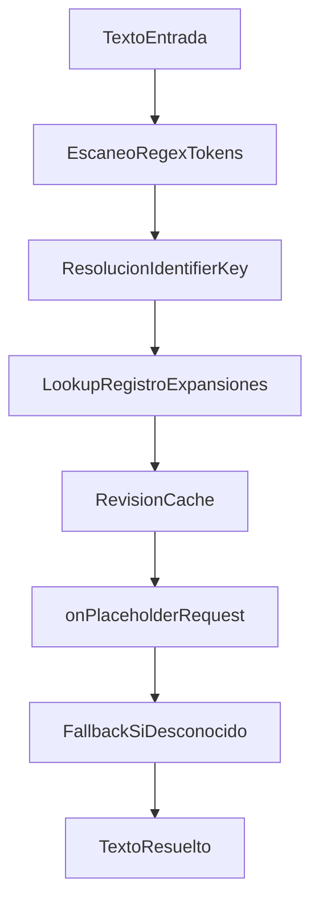
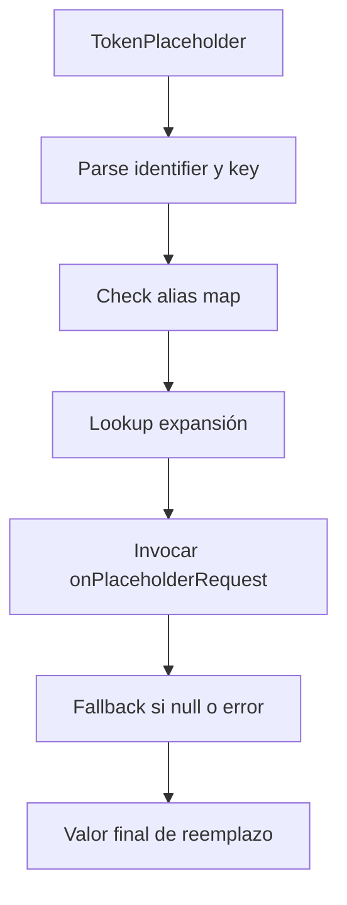
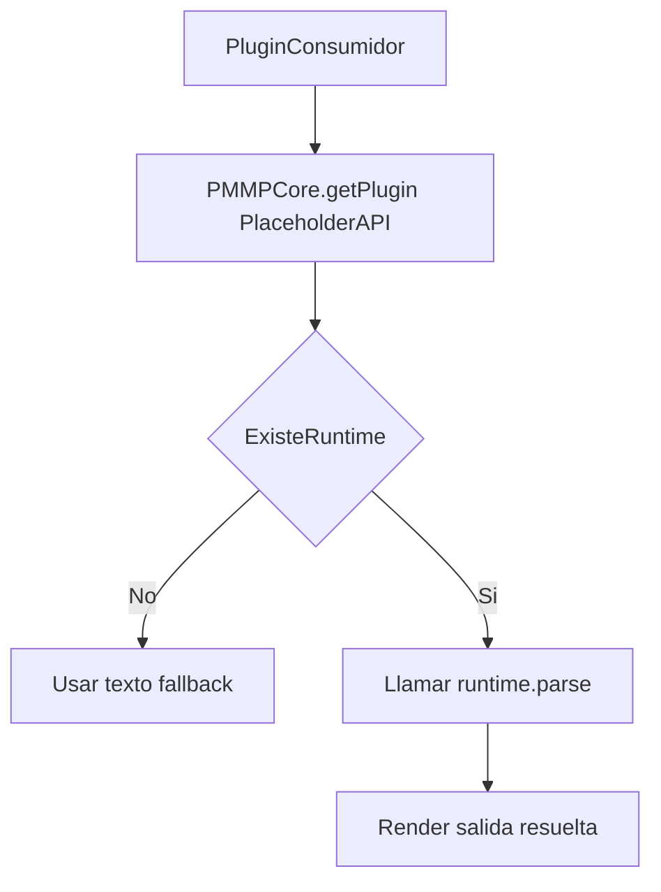

# PMMPCore - Documentacion de PlaceholderAPI

Idioma: [English](PLACEHOLDERAPI_DOCUMENTATION.md) | **Espanol**

## 1. Proposito y alcance

PlaceholderAPI es un motor de placeholders a nivel plugin para PMMPCore.

Aporta:

- Parseo de placeholders en strings.
- Expansiones por defecto (`general`, `player`, `server`, `time`).
- Contrato para expansiones custom de plugins de terceros.
- Integracion directa con otros plugins (por ejemplo, PureChat).

Nota de arquitectura:

- PlaceholderAPI es un plugin, no parte de los exports del core de PMMPCore.

## 1.1 Pipeline de resolucion



## 2. Sintaxis y reglas de resolucion

- Sintaxis principal: `%identifier_key%` (ejemplo: `%player_name%`).
- Sintaxis alias: `%key%` (resuelta por expansion `general`).
- Placeholder desconocido se conserva sin cambios (fallback seguro).
- El matching es case-insensitive en esta implementacion.

## 3. Comandos

- `/papi list`
- `/papi parse <text>`
- `/papi test <expansion> <placeholder>`
- `/papi reload`

Nota del parser de comandos Bedrock:

- `%...%` puede interpretarse como sintaxis si no va entre comillas.
- En `/papi parse` usa comillas:

```text
/papi parse "%online_players%"
```

Comando recomendado para test seguro sin pelear con `%...%`:

```text
/papi test player name
```

## 4. Permisos

- `placeholderapi.admin`
- `placeholderapi.list`
- `placeholderapi.parse`
- `placeholderapi.test`

## 5. Expansiones incluidas

### 5.1 General (`general`)

- `%online_players%`
- `%max_players%`
- `%server_time%`
- `%server_date%`
- `%random_number%`

### 5.2 Player (`player`)

- `%player_name%`
- `%player_display_name%`
- `%player_health%`
- `%player_max_health%`
- `%player_x%`, `%player_y%`, `%player_z%`
- `%player_world%`
- `%player_ip%` (`n/a` en runtime Bedrock)
- `%player_ping%` (`n/a` en runtime Bedrock)

### 5.3 Server (`server`)

- `%server_name%`
- `%server_motd%`
- `%server_ip%`
- `%server_port%`
- `%server_max_players%`
- `%server_online_players%`
- `%server_version%`
- `%server_tps%`
- `%server_load%`

### 5.4 Time (`time`)

- `%time_current%`
- `%time_date%`
- `%time_datetime%`
- `%time_timestamp%`

## 6. Acceso al runtime desde otro plugin

Usa el registro de plugins de PMMPCore para acceder al runtime:

```js
import { PMMPCore } from "../../PMMPCore.js";

const placeholderPlugin = PMMPCore.getPlugin("PlaceholderAPI");
const papi = placeholderPlugin?.runtime ?? null;
const line = papi?.parse("Bienvenido %player_name% - Online: %online_players%", player) ?? "fallback";
```

## 7. Contrato para expansion custom

Crea un objeto con:

- `identifier` (`string`)
- `version` (`string`)
- `author` (`string`)
- `onPlaceholderRequest(player, key, context)` (`function`)

Ejemplo:

```js
const placeholderPlugin = PMMPCore.getPlugin("PlaceholderAPI");
const papi = placeholderPlugin?.runtime ?? null;

const playtimeExpansion = {
  identifier: "playtime",
  version: "1.0.0",
  author: "TuNombre",
  onPlaceholderRequest(player, key) {
    if (!player) return null;
    if (key === "seconds") return "0";
    return null;
  },
};

papi?.registerExpansion(playtimeExpansion);
// Uso: %playtime_seconds%
```

## 8. Integracion con PureChat

PureChat resuelve primero placeholders internos (`{msg}`, `{display_name}`, etc.) y luego ejecuta PlaceholderAPI para tokens `%...%`.

Ejemplo de formato:

```text
/pchat setformat OP global "[%time_current%] %player_name% (%online_players%) > {msg}"
```

Orden de integracion:

1. PureChat resuelve placeholders internos `{...}`.
2. PlaceholderAPI resuelve tokens `%...%`.

Asi ambos sistemas pueden convivir en el mismo formato.

## 9. Checklist de prueba rapida

```text
/papi list
/papi parse "%online_players%"
/papi parse "Hola %player_name%"
/papi test player name
/papi test time current
/papi parse "NoExiste: %foo_bar%"
```

Esperado:

- placeholders validos se resuelven,
- placeholders desconocidos se mantienen sin cambios.

## 10. Troubleshooting

### `parse` falla con error de sintaxis al usar `%token%`

- Usa comillas en Bedrock:
  - `/papi parse "%online_players%"`
- O usa `/papi test <expansion> <key>`.

### Se resuelve en `/papi parse` pero no en formato de chat

- Verifica que el plugin consumidor (por ejemplo PureChat) use runtime de PlaceholderAPI.
- Verifica que editaste el formato del grupo efectivo.

### Placeholders de jugador no se resuelven

- Confirma que hay contexto de jugador valido.
- En contexto no-jugador usa placeholders server/time/general.

## 11. Vistas runtime e integración Mermaid

### 11.1 Flujo de resolución por expansión



### 11.2 Flujo de integración de plugin consumidor



## 10. Limites y notas

- Algunos placeholders de PocketMine no son trasladables 1:1 a Bedrock.
- Valores de red como IP/ping se exponen con fallback seguro.
- PlaceholderAPI sigue el lifecycle de PMMPCore (`onEnable`, `onStartup`, `onWorldReady`, `onDisable`).
