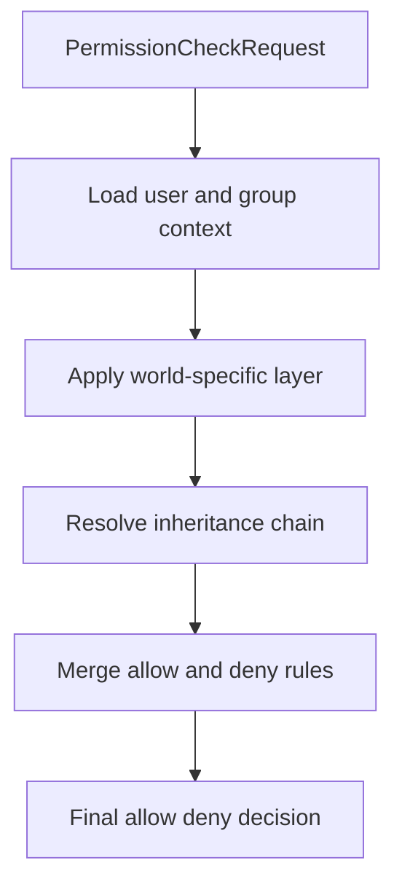

# PMMPCore - PurePerms User Manual

Language: **English** | [Español](PUREPERMS_DOCUMENTATION.es.md)

## 1. What PurePerms Does

PurePerms is the permission and rank manager for PMMPCore.

You use it to:

- create ranks (groups) like `Guest`, `Mod`, `Admin`, `OP`;
- assign players to ranks;
- grant or deny permission nodes to groups and users;
- build inheritance chains between ranks;
- inspect and debug active permissions.

## 2. How Permissions Work (Simple Mental Model)

Each player can receive permissions from multiple layers:

1. **Group permissions** from the player's rank.
2. **Inherited group permissions** from parent ranks.
3. **Direct user permissions** assigned with user commands.
4. **World-specific entries** when world scoping is used.

Important rules:

- `node.name` = allow.
- `-node.name` = deny.
- `*` = wildcard (all permissions).
- Deny of the same node has priority over allow.

## 3. Default Groups

PurePerms auto-ensures these groups exist:

- `Guest` (default group)
- `Mod` (inherits `Guest`)
- `Admin` (inherits `Mod`)
- `OP` (inherits `Admin`, includes wildcard)

If stored data is missing these groups, plugin startup/reload recreates them.

## 3.1 Configuration reference (`scripts/plugins/PurePerms/config.js`)

PurePerms is configured by editing `scripts/plugins/PurePerms/config.js`.

### `PUREPERMS_CONFIG`

- `dataProvider`: storage backend selector (current: `"dynamic-properties"`).
- `defaultLanguage`: locale key for messages (`"en"` default).
- `disableOp`: if `true`, disables Bedrock “operator” shortcuts and relies on PurePerms instead.
- `enableMultiworldPerms`: if `true`, enables world-scoped permissions integration (advanced).
- `enableNoeulSixtyfour`: if `true`, enables the “NoeulSixtyfour” auth-related feature set (advanced/optional).
- `noeulMinimumPwLength`: minimum password length when the Noeul feature is enabled.
- `superadminRanks`: group names that are treated as protected “superadmin” ranks (default: `["OP"]`).

### `DEFAULT_GROUPS`

This object defines the initial group set that PurePerms ensures exists. Per group:

- `alias`: short name.
- `isDefault`: whether this group is the default.
- `inheritance`: list of parent groups.
- `permissions`: list of permission nodes.
  - `node.name` allows
  - `-node.name` denies
  - `*` wildcard
- `worlds`: optional per-world overrides (advanced).

### `PUREPERMS_SCHEMA_VERSION`

- Current schema version stored for migrations (default: `1`).

## 4. Before You Start (Recommended First Commands)

Run these first:

1. `/ppreload`
2. `/groups`
3. `/grpinfo Guest`
4. `/grpinfo OP`

This confirms the plugin is loaded and default groups are present.

## 5. Full Command Reference

All commands are registered as `pmmpcore:<command>`, but chat usually allows short form `/command`.

### 5.1 `/ppinfo`

- **Purpose:** show plugin status summary.
- **Permission:** `pperms.command.ppinfo`
- **Syntax:** `/ppinfo`
- **Output includes:** group count, user count, multiworld/noeul flags.

### 5.2 `/ppreload`

- **Purpose:** reload runtime config and refresh default structures.
- **Permission:** `pperms.command.ppreload`
- **Syntax:** `/ppreload`
- **Use when:** you changed `config.js` and want to apply it without full restart.

### 5.3 `/groups`

- **Purpose:** list all existing groups.
- **Permission:** `pperms.command.groups`
- **Syntax:** `/groups`

### 5.4 `/addgroup <group>`

- **Purpose:** create a new group.
- **Permission:** `pperms.command.addgroup`
- **Syntax:** `/addgroup Builder`
- **Common use:** create role tiers beyond defaults.

### 5.5 `/rmgroup <group>`

- **Purpose:** remove a group.
- **Permission:** `pperms.command.rmgroup`
- **Syntax:** `/rmgroup Builder`
- **Notes:**
  - default group cannot be removed;
  - configured superadmin ranks are protected.

### 5.6 `/grpinfo <group> [world]`

- **Purpose:** inspect one group.
- **Permission:** `pperms.command.grpinfo`
- **Syntax:** `/grpinfo Admin`
- **Optional:** add world for world-layer details.
- **Shows:** alias, default state, inheritance, permission counts.

### 5.7 `/addparent <target_group> <parent_group>`

- **Purpose:** make one group inherit another.
- **Permission:** `pperms.command.addparent`
- **Syntax:** `/addparent Admin Mod`
- **Result:** Admin gets Mod permissions too.
- **Safety:** cycles are blocked automatically.

### 5.8 `/rmparent <target_group> <parent_group>`

- **Purpose:** remove inheritance link.
- **Permission:** `pperms.command.rmparent`
- **Syntax:** `/rmparent Admin Mod`

### 5.9 `/defgroup <group> [world]`

- **Purpose:** set default group globally or for a world.
- **Permission:** `pperms.command.defgroup`
- **Syntax:** `/defgroup Guest`

### 5.10 `/listgperms <group> <page> [world]`

- **Purpose:** show effective permissions of a group.
- **Permission:** `pperms.command.listgperms`
- **Syntax:** `/listgperms OP 1`
- **Pagination:** use page 1/2/3...

### 5.11 `/setgperm <group> <permission> [world]`

- **Purpose:** allow a permission node to a group.
- **Permission:** `pperms.command.setgperm`
- **Syntax examples:**
  - `/setgperm Mod pperms.command.ppinfo`
  - `/setgperm OP *`

### 5.12 `/unsetgperm <group> <permission> [world]`

- **Purpose:** deny a permission node for a group.
- **Permission:** `pperms.command.unsetgperm`
- **Syntax:** `/unsetgperm Mod pperms.command.ppinfo`
- **Stored as:** `-pperms.command.ppinfo`

### 5.13 `/usrinfo <player> [world]`

- **Purpose:** inspect one user's permission profile.
- **Permission:** `pperms.command.usrinfo`
- **Syntax:** `/usrinfo ByCesarKun`
- **Important field:** `Direct permissions`
  - this is only permissions assigned directly to the user.
  - group-based permissions are separate.

### 5.14 `/setgroup <player> <group> [world]`

- **Purpose:** assign a player to a group.
- **Permission:** `pperms.command.setgroup`
- **Syntax:** `/setgroup ByCesarKun OP`
- **Superadmin behavior:**
  - some ranks can be console-protected (`superadminRanks`);
  - native Bedrock OP is allowed to assign `OP` according to current plugin logic.

### 5.15 `/setuperm <player> <permission> [world]`

- **Purpose:** add direct user permission.
- **Permission:** `pperms.command.setuperm`
- **Syntax:** `/setuperm ByCesarKun pperms.command.fperms`

### 5.16 `/unsetuperm <player> <permission> [world]`

- **Purpose:** deny direct user permission.
- **Permission:** `pperms.command.unsetuperm`
- **Syntax:** `/unsetuperm ByCesarKun pperms.command.fperms`

### 5.17 `/listuperms <player> <page> [world]`

- **Purpose:** list user effective permissions.
- **Permission:** `pperms.command.listuperms`
- **Syntax:** `/listuperms ByCesarKun 1`

### 5.18 `/fperms <prefix>`

- **Purpose:** search permission nodes by prefix.
- **Permission:** `pperms.command.fperms`
- **Syntax:** `/fperms pperms.command`
- **Use case:** discover available nodes quickly.

### 5.19 `/ppsudo <login|register> <password>`

- **Purpose:** manage Noeul account state.
- **Permission:** `pperms.command.ppsudo`
- **Syntax examples:**
  - `/ppsudo register 123456`
  - `/ppsudo login 123456`

## 6. Common Admin Workflows

### Create a new moderation rank

1. `/addgroup Helper`
2. `/addparent Helper Guest`
3. `/setgperm Helper pperms.command.ppinfo`
4. `/setgperm Helper pperms.command.groups`
5. `/setgroup SomePlayer Helper`

### Give full management access to OP group

1. `/setgperm OP *`
2. `/listgperms OP 1`

### Debug "I have no permission"

1. `/usrinfo <player>`
2. `/grpinfo <group_from_usrinfo>`
3. `/listgperms <group> 1`
4. `/listuperms <player> 1`

Check if:

- the player is in expected group;
- the permission exists in group/user layers;
- there is a negative permission blocking it.

## 7. OP Integration

Current behavior:

- if `disableOp: false`, native Bedrock operators bypass permission checks;
- native operators are synced into group `OP` on spawn when needed.

This helps keep vanilla OP and PurePerms rank state aligned.

## 8. Configuration Guide (`config.js`)

Main keys:

- `disableOp`
  - `false`: OP bypass enabled.
  - `true`: OP bypass disabled.
- `enableMultiworldPerms`
  - `true`: evaluate world-specific permission entries.
- `superadminRanks`
  - ranks with restricted assignment/removal logic.

## 9. Quick Verification Checklist

After installation or config changes:

1. `/ppreload`
2. `/groups`
3. `/grpinfo OP`
4. `/setgroup <player> OP`
5. `/usrinfo <player>`
6. `/ppinfo`

If all commands return expected output, setup is ready.

---

## 10. Installation and Enablement (Step-by-step)

1. Ensure plugin exists in `scripts/plugins/PurePerms/`.
2. Ensure import in `scripts/plugins.js`.
3. Start world and confirm logs indicate PurePerms load.
4. Run:
   - `/ppreload`
   - `/groups`
   - `/ppinfo`

If these work, PurePerms is active and responding.

## 11. Lifecycle Integration (Operational behavior)

- `onEnable()`
  - Initializes service, binds permission backend in PMMPCore, prepares migrations.
- `onWorldReady()`
  - Runs migration-safe initialization and emits readiness behavior.
- `onDisable()`
  - Detaches backend from PMMPCore and stops runtime-only state.

This keeps permission service availability aligned with plugin runtime state.

## 12. Data and Persistence Model (Operational view)

PurePerms persists:

- group definitions
- user group assignment
- user direct permissions
- optional world-scoped overrides
- migration/version state

Operational rules:

- prefer additive updates (avoid destructive resets)
- keep permission seed idempotent
- reload config with `/ppreload` after config updates

## 13. Security and Governance Notes

- Keep `superadminRanks` minimal.
- Restrict high-impact commands (`setgroup`, `setgperm`, `unsetgperm`, `defgroup`) to trusted roles only.
- Audit wildcard (`*`) use periodically.
- Keep command logs for admin-level changes where possible.

## 14. FAQ

### Why does a user still fail after being in OP group?

Check for negative permission (`-node`) in user/group layers; denies override allows.

### Should I use many direct user permissions?

Prefer group-based permissions and use direct user nodes only for exceptions.

### Is `/ppreload` enough after all config changes?

For runtime behavior, usually yes. For major structural changes, restart plus verification commands is safer.

### Can I remove default groups?

Default/protected groups may be recreated or blocked from deletion by design.

### When should I enable world-specific permissions?

Enable `enableMultiworldPerms` only when your server actually uses per-world access models.

## 15. Release Checklist (PurePerms)

- [ ] Default groups present and healthy.
- [ ] Permission checks behave as expected for Guest/Mod/Admin/OP.
- [ ] No accidental wildcard grants.
- [ ] Superadmin protections validated.
- [ ] `/ppreload` works and keeps state consistent.
- [ ] PMMPCore permission service is bound/unbound correctly across enable/disable.

## 16. Mermaid Architecture and Decision Flows

### 16.1 Permission resolution flow



### 16.2 Troubleshooting tree

```mermaid
flowchart TD
  symptom[Observed symptom] --> class{Class}
  class -->|UnexpectedDeny| checkNegatives[Check negative nodes and inheritance]
  class -->|UnexpectedAllow| checkWildcard[Check wildcard and group defaults]
  class -->|WorldMismatch| checkWorldScope[Check world-specific settings]
  class -->|AdminLockout| checkSuperadmin[Check superadmin protections and actor type]
```
