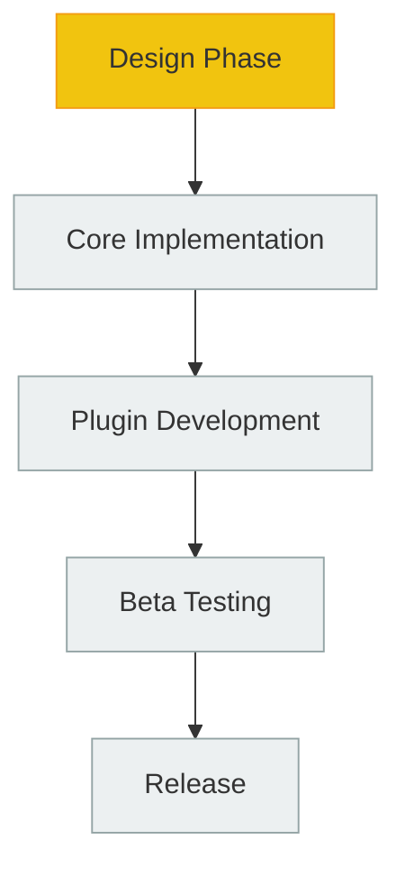

# PMMPCore

<div align="center">


**Framework modular para Minecraft Bedrock Edition**

[](https://github.com/ByCesarDev/PMMPCore)
[](LICENSE)
[](https://www.minecraft.net/es-es/download/bedrock-edition)

[Documentación](./ROADMAP.md) · [Reportar Issues](../../issues) · [Discutir](../../discussions)

</div>

---

## Overview

PMMPCore es un **framework revolucionario** que lleva la arquitectura de servidores tipo PocketMine-MP al mundo de Minecraft Bedrock Edition. Crea un ecosistema completo de plugins modulares dentro de las limitaciones técnicas de Bedrock, permitiendo desarrollar, instalar y gestionar funcionalidades avanzadas de forma estructurada y profesional.

## ¿Por qué PMMPCore?

### El Problema
Minecraft Bedrock Edition tiene limitaciones significativas para el desarrollo de mods:
- No hay acceso al sistema de archivos
- No existe carga dinámica de plugins
- Los addons tradicionales son muy limitados

### La Solución
PMMPCore implementa una arquitectura innovadora que:
- **Simula un sistema de plugins real** mediante imports generados
- **Proporciona persistencia de datos** usando DynamicProperties
- **Crea un ecosistema modular** similar a servidores Java
- **Permite monetización** de contenido premium

## Características Principales

### Core System
- **Plugin Registry**: Sistema centralizado para registrar y gestionar plugins
- **Database Manager**: Persistencia integrada con DynamicProperties
- **API Global**: Interfaz unificada para todos los componentes
- **Event Bus**: Comunicación eficiente entre módulos
- **Scheduler**: Sistema de tareas centralizado

### Plugin Architecture
- **Modular Design**: Plugins independientes con dependencias claras
- **Automatic Builder**: Generación de código de carga mediante Node.js
- **Dependency Management**: Sistema de dependencias y soft-dependencies
- **Lifecycle Management**: Métodos `onEnable()` y `onDisable()`

### Developer Experience
- **Command System**: Gestión unificada de comandos (`/plugins`, `/pl`)
- **Permission Framework**: Base para sistemas de permisos
- **Economy Integration**: Soporte para sistemas económicos
- **Multiworld Support**: Gestión de múltiples mundos

## Estado Actual del Proyecto

<div align="center">



</div>

**Fase Actual: Diseño Arquitectónico** 
- Arquitectura completa definida y documentada
- Especificaciones técnicas detalladas
- Roadmap de plugins priorizado

## Ecosistema de Plugins

### Fase 1 - Core Plugins
- **Multiworld**: Gestión de múltiples mundos
- **PurePerms**: Sistema de permisos avanzado
- **CommandManager**: Framework de comandos
- **PureChat**: Sistema de chat mejorado

### Fase 2 - Economy & Utilities
- **EconomyAPI**: Sistema económico completo
- **WarpGUI**: Interfaz de teletransporte
- **Portals**: Sistema de portales

### Fase 3 - Advanced Features
- **SignShop**: Tiendas con carteles
- **CPlots**: Sistema de parcelas

### Fase 4 - Premium Content
- **ScoreHub**: Sistema de puntuaciones
- **WelcomeMessage**: Mensajes de bienvenida

## Arquitectura Técnica

```
PMMPCore Framework
    |
    |-- Core System
    |   |-- Plugin Registry
    |   |-- Database Manager
    |   |-- Event Bus
    |   |-- Command System
    |
    |-- Plugin Ecosystem
    |   |-- Multiworld
    |   |-- EconomyAPI
    |   |-- PurePerms
    |   |-- + More...
    |
    |-- Build System
        |-- Node.js Builder
        |-- Auto-generated Imports
        |-- Dependency Resolution
```

## Modelo de Negocio

### Open Source
- PMMPCore Core (Gratis)
- Plugins básicos (Gratis)
- Documentación completa

### Premium Content
- EconomyAPI Pro
- PlotSystem Advanced
- AntiCheat System

### Plugin Packs
- Survival Pack (Completo)
- RPG Pack (Rol)
- Prison Pack (Prisión)

## Visión a Futuro

PMMPCore tiene como objetivo convertirse en:

1. **Estándar de la Industria**: El framework reference para Bedrock Edition
2. **Ecosistema Vibrante**: Comunidad de desarrolladores y plugins
3. **Plataforma Comercial**: Oportunidades de monetización legítimas
4. **Base Educativa**: Recursos para aprender desarrollo de mods

---

## Documentación

Para ver la arquitectura técnica completa, especificaciones de implementación y detalles del roadmap:

**[Ver Documentación Técnica Completa](./ROADMAP.md)**

---

## Contribución

Actualmente el proyecto está en fase de diseño. Pronto abriremos oportunidades para contribuir en:

- Implementación del Core
- Desarrollo de plugins
- Testing y QA
- Documentación

---

<div align="center">

**Built with passion for the Minecraft Bedrock community**

[](https://discord.gg/your-server)
[](https://twitter.com/your-handle)

</div>
